# Alternative Modes (Niche Use Cases)

This document covers the alternative port forwarding modes (`manual` and `nostr`) which use the `tunnel-rs-ice` binary. For most use cases, use [iroh mode](../README.md#iroh-mode) with the `tunnel-rs` binary.

## manual Mode

> Use this mode for: (1) complete independence from third-party services (disable STUN), or (2) offline/LAN-only operation when no internet is available.

Uses full ICE (Interactive Connectivity Establishment) with str0m + quinn QUIC. Signaling is done via manual copy-paste.

> **Summary:** Manual copy-paste signaling, full ICE NAT traversal via STUN, no relay fallback.

### Architecture

```
+-----------------+        +-----------------+                    +-----------------+        +-----------------+
| SSH Client      |  TCP   | client          |  ICE/QUIC          | server          |  TCP   | SSH Server      |
|                 |<------>| (local:2222)    |<===================|                 |<------>| (local:22)      |
|                 |        |                 |  (copy-paste)      |                 |        |                 |
+-----------------+        +-----------------+                    +-----------------+        +-----------------+
     Client Side                                                        Server Side
```

### Quick Start

1. **Client** starts first and outputs an offer:
   ```bash
   tunnel-rs-ice client manual --source tcp://127.0.0.1:22 --target 127.0.0.1:2222
   ```

   Copy the `-----BEGIN TUNNEL-RS MANUAL OFFER-----` block.

2. **Server** validates the source request and outputs an answer:
   ```bash
   tunnel-rs-ice server manual --allowed-tcp 127.0.0.0/8
   ```

   Paste the offer, then copy the `-----BEGIN TUNNEL-RS MANUAL ANSWER-----` block.

3. **Client** receives the answer:

   Paste the answer into the client terminal.

4. **Connect**:
   ```bash
   ssh -p 2222 user@127.0.0.1
   ```

### UDP Tunnel (e.g., WireGuard/Game/DNS)

```bash
# Client (starts first)
tunnel-rs-ice client manual --source udp://127.0.0.1:51820 --target 0.0.0.0:51820

# Server (validates and responds)
tunnel-rs-ice server manual --allowed-udp 127.0.0.0/8
```

### CLI Options

#### server manual

| Option | Default | Description |
|--------|---------|-------------|
| `--allowed-tcp` | none | Allowed TCP networks in CIDR notation (repeatable) |
| `--allowed-udp` | none | Allowed UDP networks in CIDR notation (repeatable) |
| `--stun-server` | public | STUN server(s), repeatable |
| `--no-stun` | false | Disable STUN (no external infrastructure, CLI only) |

#### client manual

| Option | Default | Description |
|--------|---------|-------------|
| `--source`, `-s` | required | Source to request from server (e.g., tcp://127.0.0.1:22) |
| `--target`, `-t` | required | Local address to listen on (e.g., 127.0.0.1:2222) |
| `--stun-server` | public | STUN server(s), repeatable |
| `--no-stun` | false | Disable STUN (no external infrastructure, CLI only) |

Note: Config file options (`-c`, `--default-config`, `--config-stdin`) are at the `server`/`client` command level. See [Configuration Files](../README.md#configuration-files).

### Connection Types

After ICE negotiation, the connection type is displayed:

```
ICE connection established!
   Connection: Direct (Host)
   Local: 10.0.0.5:54321 -> Remote: 10.0.0.10:12345
```

| Type | Description |
|------|-------------|
| Direct (Host) | Both peers on same network |
| NAT Traversal (Server Reflexive) | Peers behind NAT, using STUN |

### Notes

- Full ICE improves NAT traversal, but without TURN/relay servers symmetric NATs can still fail
- Signaling payloads include a version number; mismatches are rejected

### Detailed Architecture

> **Note:** manual mode implements full ICE with STUN-only connectivity checks. TURN/relay servers are not implemented. This means symmetric NAT peers may still fail to establish a connection without a relay fallback mechanism.

#### Architecture Overview

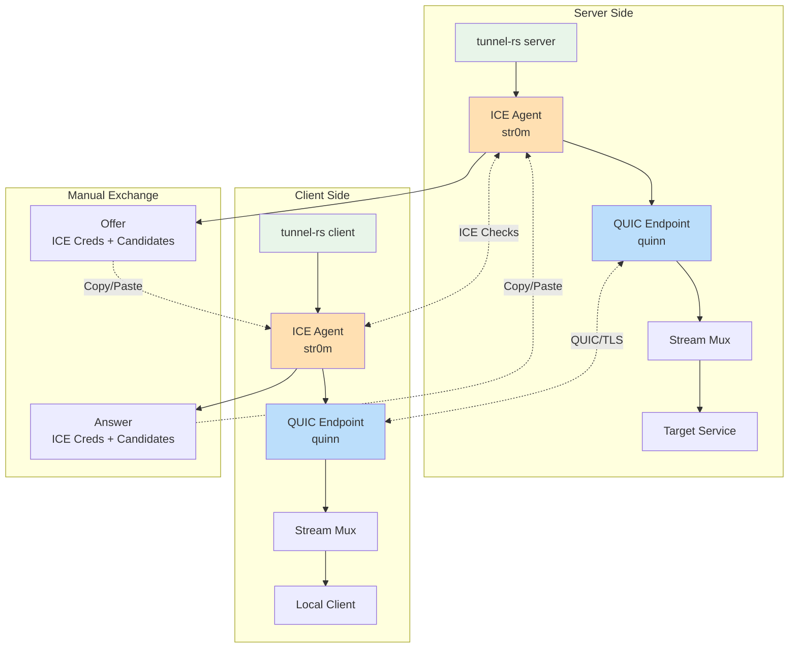

#### Full ICE + QUIC Stack

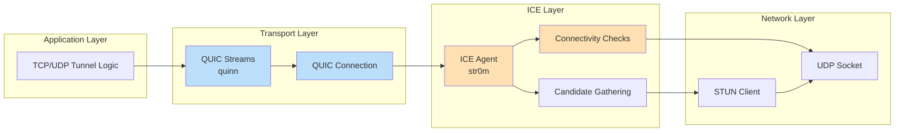

#### ICE Candidate Gathering

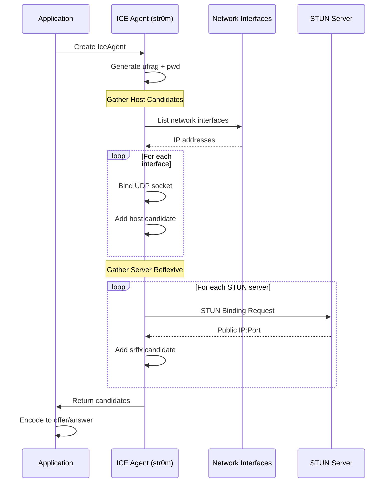

#### ICE Connectivity Checks

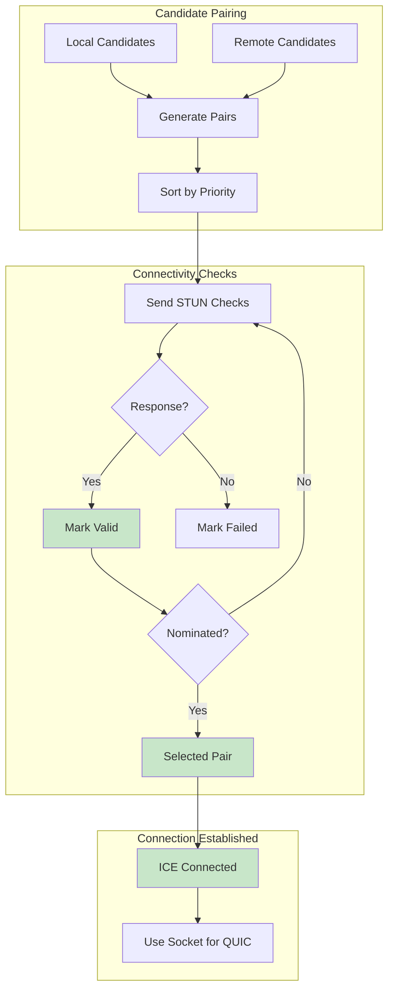

#### Signaling Flow

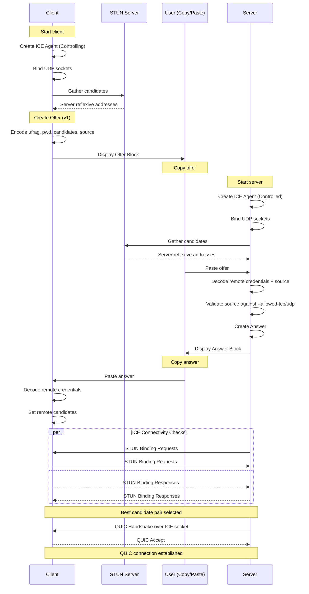

#### QUIC Over ICE Socket

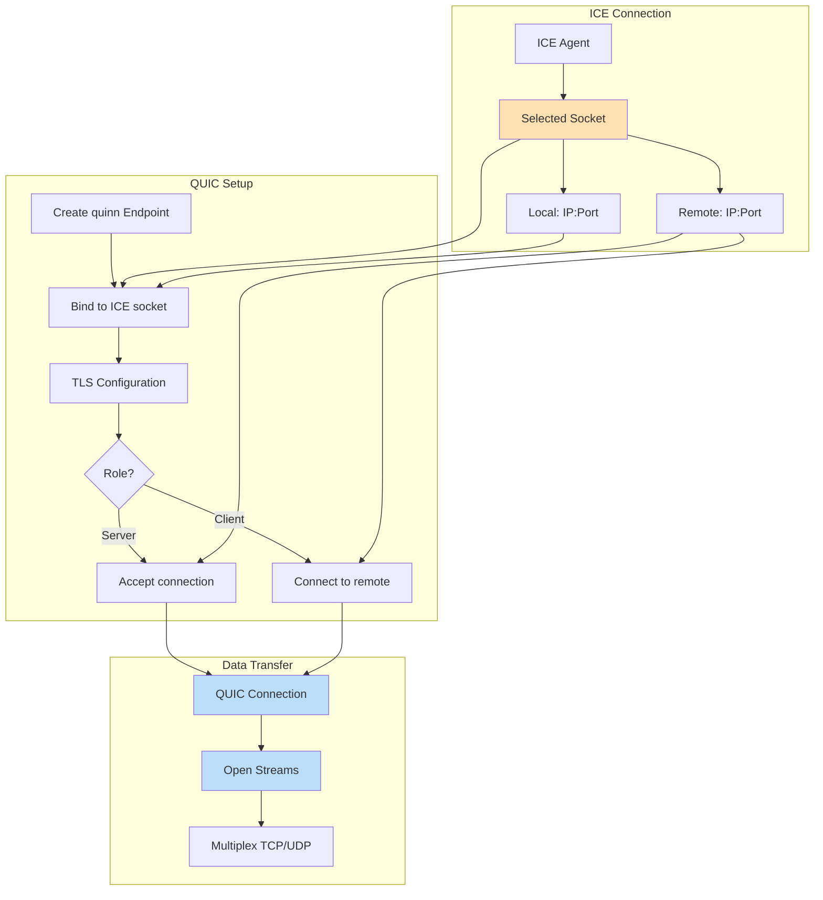

#### Stream Multiplexing

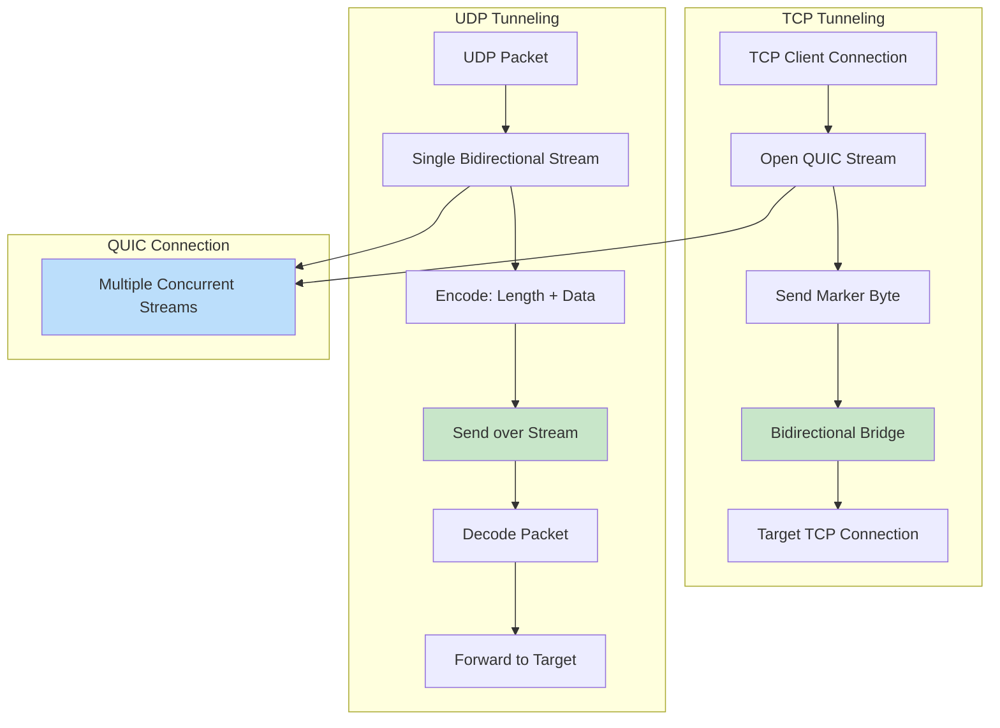

#### Connection Type Detection

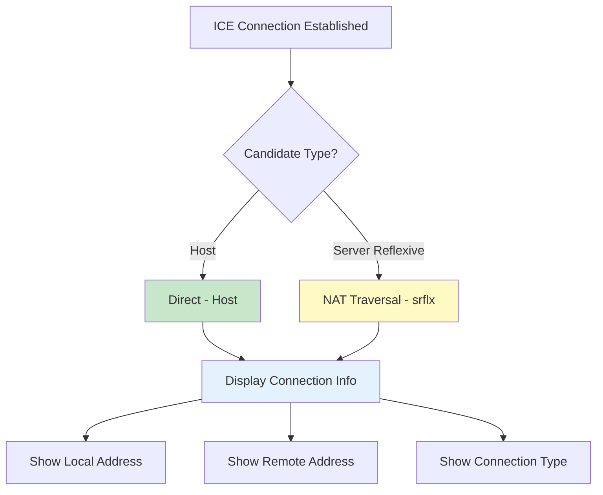

---

## nostr Mode

> Use this mode if you want decentralized signaling without depending on iroh infrastructure.

Uses full ICE with Nostr-based signaling. Instead of manual copy-paste, ICE offers/answers are exchanged automatically via Nostr relays using static keypairs (like WireGuard).

> **Summary:** Automated signaling via Nostr relays, static WireGuard-like keys, full ICE NAT traversal, no relay fallback.

**Key Features:**
- **Static keys** — Persistent identity using nsec/npub keypairs (like WireGuard)
- **Automated signaling** — No copy-paste required; offers/answers exchanged via Nostr relays
- **Full ICE** — Same NAT traversal as manual mode (str0m + quinn)
- **Deterministic pairing** — Transfer ID derived from both pubkeys; no coordination needed

### Architecture

```
+-----------------+        +-----------------+        +---------------+        +-----------------+        +-----------------+
| SSH Client      |  TCP   | client          |  ICE   |   Nostr       |  ICE   | server          |  TCP   | SSH Server      |
|                 |<------>| (local:2222)    |<======>|   Relays      |<======>|                 |<------>| (local:22)      |
|                 |        |                 |  QUIC  | (signaling)   |  QUIC  |                 |        |                 |
+-----------------+        +-----------------+        +---------------+        +-----------------+        +-----------------+
     Client Side                                                                     Server Side
```

### Quick Start

#### 1. Generate Keypairs (One-Time Setup)

Each peer needs their own keypair:

```bash
# On server machine
tunnel-rs-ice generate-nostr-key --output ./server.nsec
# Output (stdout): npub: npub1server...

# On client machine
tunnel-rs-ice generate-nostr-key --output ./client.nsec
# Output (stdout): npub: npub1client...
```

Exchange public keys (npub) between peers.

#### 2. Start Tunnel

**Server** (on server with SSH — waits for client connections):
```bash
tunnel-rs-ice server nostr \
  --allowed-tcp 127.0.0.0/8 \
  --nsec-file ./server.nsec \
  --peer-npub npub1client...
```

**Client** (on client — initiates connection):
```bash
tunnel-rs-ice client nostr \
  --source tcp://127.0.0.1:22 \
  --target 127.0.0.1:2222 \
  --nsec-file ./client.nsec \
  --peer-npub npub1server...
```

#### 3. Connect

```bash
ssh -p 2222 user@127.0.0.1
```

### UDP Tunnel (e.g., WireGuard/Game/DNS)

```bash
# Server (allows UDP traffic to localhost)
tunnel-rs-ice server nostr \
  --allowed-udp 127.0.0.0/8 \
  --nsec-file ./server.nsec \
  --peer-npub npub1client...

# Client (requests direct UDP tunnel)
tunnel-rs-ice client nostr \
  --source udp://127.0.0.1:51820 \
  --target udp://0.0.0.0:51820 \
  --nsec-file ./client.nsec \
  --peer-npub npub1server...
```

### CLI Options

#### server nostr

| Option | Default | Description |
|--------|---------|-------------|
| `--allowed-tcp` | - | Allowed TCP networks in CIDR (repeatable, e.g., `127.0.0.0/8`) |
| `--allowed-udp` | - | Allowed UDP networks in CIDR (repeatable, e.g., `10.0.0.0/8`) |
| `--nsec` | - | Your Nostr private key (nsec or hex format). Use this or `--nsec-file` (one required). |
| `--nsec-file` | - | Path to file containing your Nostr private key. Use this or `--nsec` (one required). |
| `--peer-npub` | required | Peer's Nostr public key (npub or hex format) |
| `--relay` | public relays | Nostr relay URL(s), repeatable |
| `--stun-server` | public | STUN server(s), repeatable |
| `--no-stun` | false | Disable STUN |
| `--republish-interval` | 10 | Seconds between re-publishing offer while waiting for answer |
| `--max-wait` | 120 | Maximum seconds to wait for answer before giving up |
| `--max-sessions` | 10 | Maximum concurrent sessions (0 = unlimited) |

#### client nostr

| Option | Default | Description |
|--------|---------|-------------|
| `--source`, `-s` | required | Source address to request from server |
| `--target`, `-t` | required | Local address to listen on (`host:port`, or `tcp://` / `udp://` prefixed) |
| `--nsec` | - | Your Nostr private key (nsec or hex format). Use this or `--nsec-file` (one required). |
| `--nsec-file` | - | Path to file containing your Nostr private key. Use this or `--nsec` (one required). |
| `--peer-npub` | required | Peer's Nostr public key (npub or hex format) |
| `--relay` | public relays | Nostr relay URL(s), repeatable |
| `--stun-server` | public | STUN server(s), repeatable |
| `--no-stun` | false | Disable STUN |
| `--republish-interval` | 5 | Seconds between re-publishing request while waiting for an offer |
| `--max-wait` | 120 | Maximum seconds to wait for offer/answer before giving up |

### Configuration File

```toml
# Server config
role = "server"
mode = "nostr"

[nostr]
nsec_file = "./server.nsec"
peer_npub = "npub1..."
relays = ["wss://relay.damus.io", "wss://nos.lol"]
stun_servers = ["stun.l.google.com:19302"]
max_sessions = 10

[nostr.allowed_sources]
tcp = ["127.0.0.0/8", "10.0.0.0/8"]
```

### Default Nostr Relays

When no relays are specified, these public relays are used:
- `wss://nos.lol`
- `wss://relay.nostr.net`
- `wss://relay.primal.net`
- `wss://relay.snort.social`

### Notes

- Keys are static like WireGuard — generate once, use repeatedly
- Transfer ID is derived from SHA256 of sorted pubkeys — both peers compute the same ID
- Signaling uses Nostr event kind 24242 with tags for transfer ID and peer pubkey
- Full ICE provides reliable NAT traversal (same as manual mode)
- **Client-first protocol:** The client initiates the connection by publishing a request first; server waits for a request before publishing its offer

> [!WARNING]
> **Containerized Environments:** nostr mode uses full ICE but without relay fallback. If both peers are behind restrictive NATs (common in Docker, Kubernetes, or cloud VMs), ICE connectivity may fail. For containerized deployments, consider using `iroh` mode which includes automatic relay fallback.

### Detailed Architecture

Nostr mode combines the full ICE implementation from manual mode with automated signaling via Nostr relays. Instead of manual copy-paste, ICE credentials are exchanged through Nostr events using static keypairs.

#### Client-Initiated Dynamic Source

All modes use a **client-initiated** model for consistent UX:

- **Server**: Whitelists allowed networks with `--allowed-tcp`/`--allowed-udp` (CIDR notation)
- **Client**: Specifies which service to tunnel with `--source` (`tcp://host:port` or `udp://host:port`)

This is similar to SSH's `-L` flag for local port forwarding, where the client chooses the destination.

```
Server: --allowed-tcp 10.0.0.0/8           # Whitelist networks (no ports)
Client: --source tcp://postgres:5432       # Request specific service
        --target 127.0.0.1:5432            # Local listen address
```

#### Architecture Overview

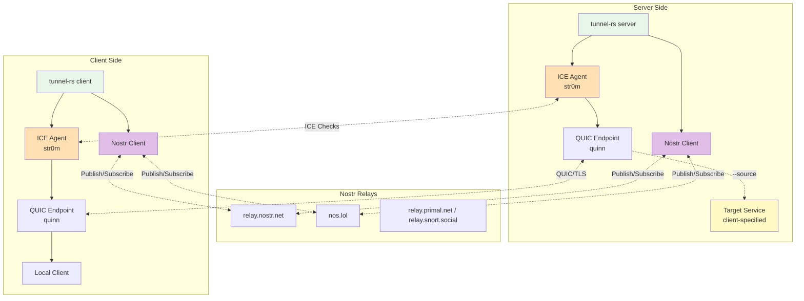

#### Client-First Signaling Flow

Nostr mode uses a client-first protocol where the client initiates the signaling exchange. This allows the server to wait for clients to come online.

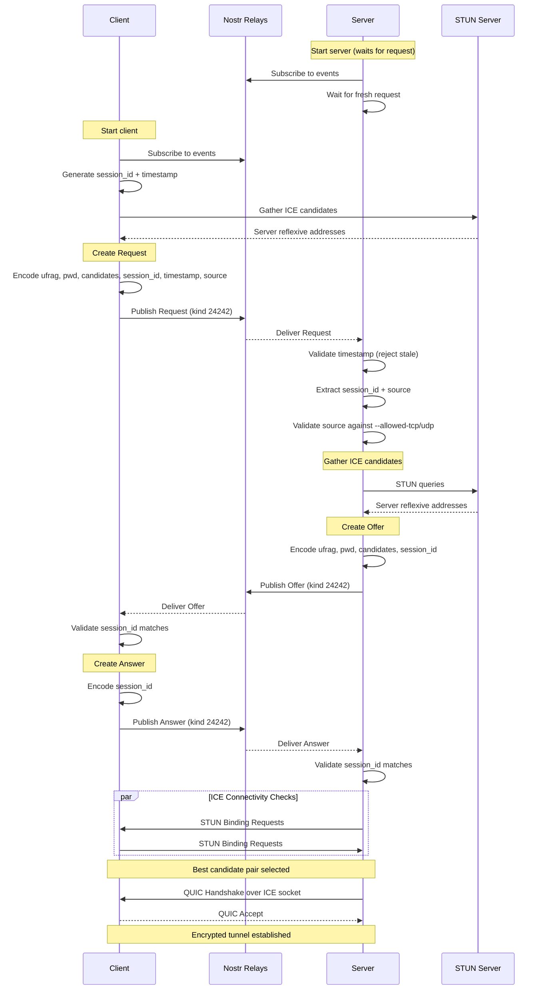

#### Session ID and Stale Event Filtering

Nostr events persist on relays, so tunnel-rs uses session IDs and timestamps to filter stale events from previous sessions:

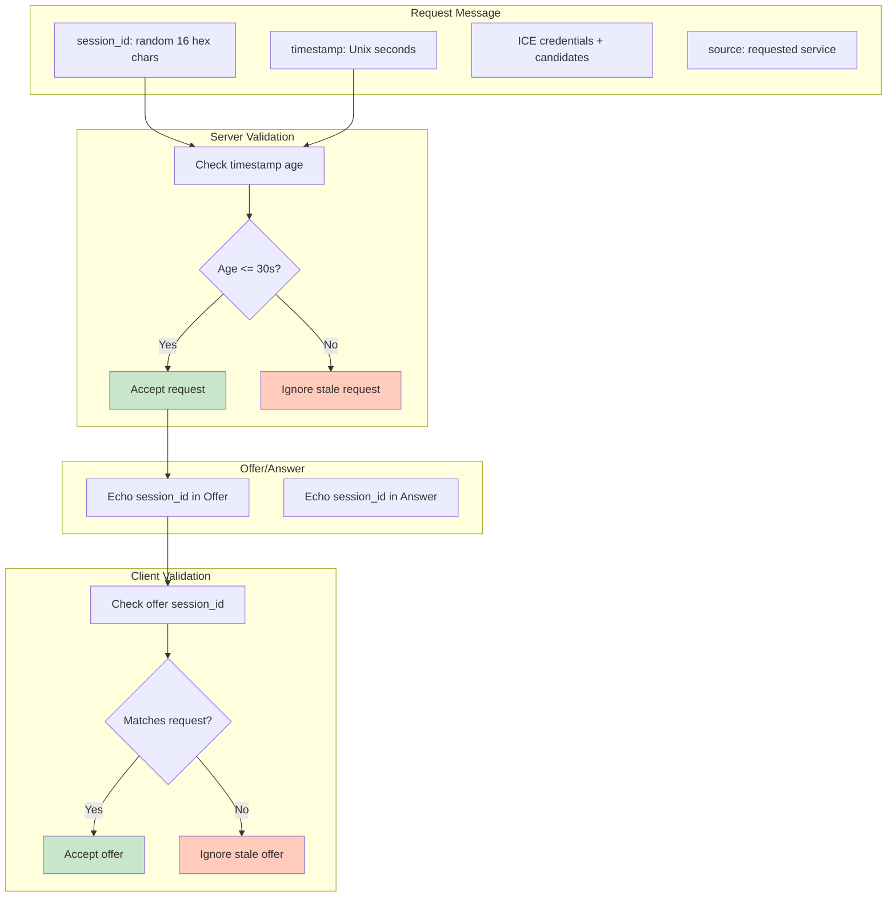

#### Nostr Event Structure

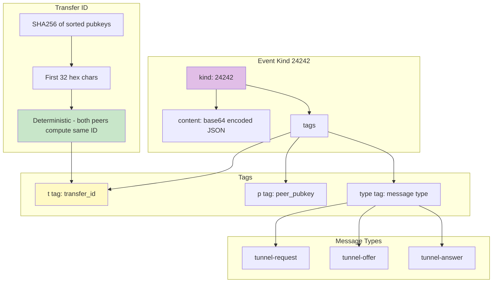

---

## Mode Capabilities

| Mode | Multi-Session | Dynamic Source | Description |
|------|---------------|----------------|-------------|
| `iroh` | **Yes** | **Yes** | Multiple clients, client chooses source |
| `nostr` | **Yes** | **Yes** | Multiple clients, client chooses source |
| `manual` | No | **Yes** | Single session, client chooses source |

**Multi-Session** = Multiple concurrent connections to the same server
**Dynamic Source** = Client specifies which service to tunnel (like SSH `-L`)

### nostr (Multi-Session + Dynamic Source)

Server whitelists networks; clients choose which service to tunnel:

```bash
# Server: whitelist networks, clients choose destination
tunnel-rs-ice server nostr --allowed-tcp 127.0.0.0/8 --nsec-file ./server.nsec --peer-npub <NPUB> --max-sessions 5

# Client 1: tunnel to SSH
tunnel-rs-ice client nostr --source tcp://127.0.0.1:22 --target 127.0.0.1:2222 ...

# Client 2: tunnel to web server (same server!)
tunnel-rs-ice client nostr --source tcp://127.0.0.1:80 --target 127.0.0.1:8080 ...
```

### Single-Session Mode (manual)

For `manual`, use separate instances for each tunnel:
- Different instances per tunnel
- Or use `iroh` or `nostr` mode for multi-session support

---

## Utility Commands

### generate-nostr-key

Generate a Nostr keypair for use with nostr mode:

```bash
# Save nsec to file and output npub
tunnel-rs-ice generate-nostr-key --output ./nostr.nsec

# Overwrite existing file
tunnel-rs-ice generate-nostr-key --output ./nostr.nsec --force

# Output nsec to stdout and npub to stderr (wireguard-style)
tunnel-rs-ice generate-nostr-key --output -
```

Output (when using `--output -`):

stdout (nsec):
```
nsec1...
```

stderr (npub):
```
npub: npub1...
```

### show-npub

Display the npub for an existing nsec key file:

```bash
tunnel-rs-ice show-npub --nsec-file ./nostr.nsec
```
