# tunnel-rs Architecture

This document provides a comprehensive overview of the tunnel-rs architecture, including detailed diagrams of all operational modes, component interactions, data flows, and security considerations.

## Table of Contents

- [System Overview](#system-overview)
- [Mode Comparison](#mode-comparison)
- [iroh Mode Architecture](#iroh-mode-architecture)
- [Configuration System](#configuration-system)
- [Security Model](#security-model)
- [Protocol Support](#protocol-support)
- [Component Details](#component-details)
- [Performance Considerations](#performance-considerations)
- [Error Handling](#error-handling)
- [Mode Capabilities](#mode-capabilities)
- [Current Limitations](#current-limitations)
- [References](#references)

---

## System Overview

tunnel-rs is a P2P TCP/UDP port forwarding tool that supports multiple distinct operational modes, each optimized for different use cases and network environments.

Binary layout:
- `tunnel-rs`: iroh mode (port forwarding)
- `tunnel-rs-ice`: manual and nostr modes (port forwarding)

> **Design Goal:** The project's primary goal is to provide a convenient way to connect to different networks for development or homelab purposes without the hassle and security risk of opening a port. It is **not** meant for production setups or designed to be performant at scale.

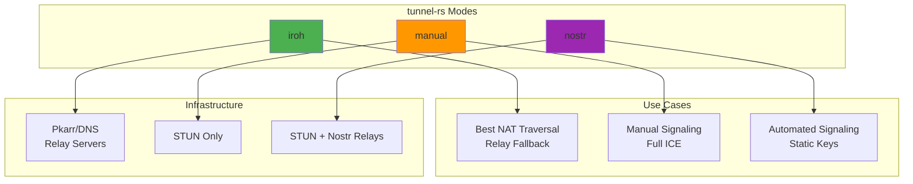

### Binaries & Crates

The project is split into separate binaries to isolate dependencies:

| Binary | Modes | Key Modules |
|--------|-------|-------------|
| `tunnel-rs` | `iroh` | `iroh_mode`, `auth` |
| `tunnel-rs-ice` | `manual`, `nostr` | `custom`, `nostr`, `transport` |

Relay-only is a CLI-only flag that forces connections through relay servers instead of attempting direct connections. It is intended for testing or special scenarios and is not supported in config files to avoid accidental activation. See `tunnel-rs --help` for usage.

### Core Components

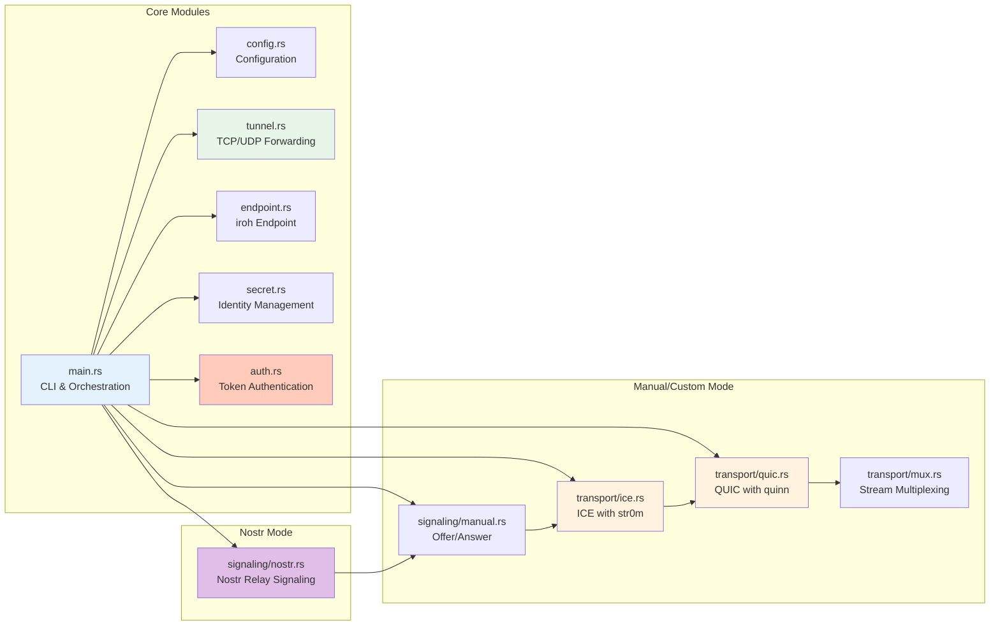

---

## Mode Comparison

> **Tip for Containerized Environments:** Use `iroh` mode for Docker, Kubernetes, and cloud VM deployments. It includes relay fallback which ensures connectivity even when both peers are behind restrictive NATs (common in cloud environments). The `nostr` and `manual` modes use STUN-only NAT traversal which may fail in these environments.

### Feature Matrix

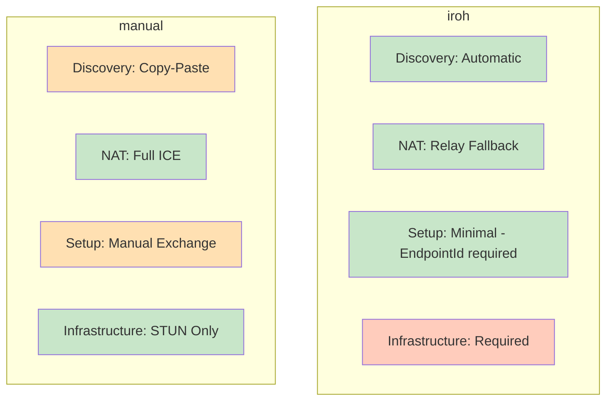

### NAT Traversal Capabilities

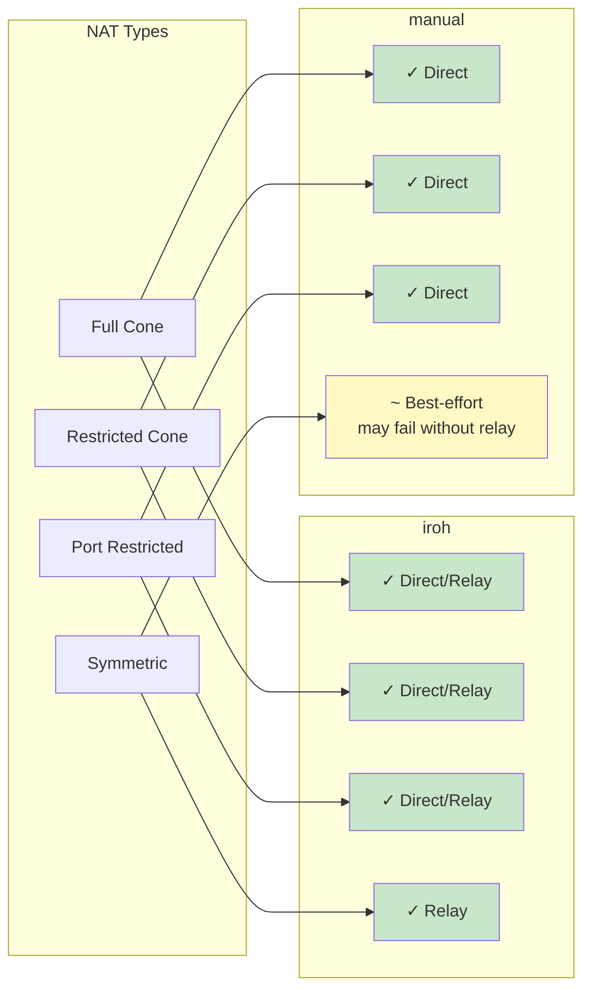

---

## iroh Mode Architecture

> For manual and nostr mode architecture, see [docs/ALTERNATIVE-MODES.md](ALTERNATIVE-MODES.md).

### Architecture Overview

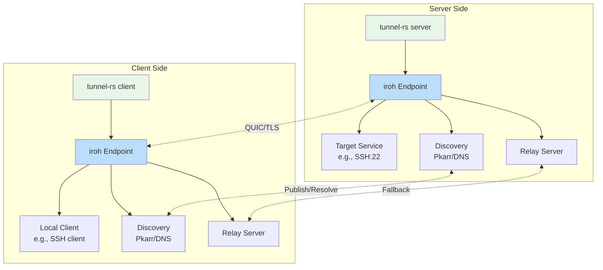

### Connection Establishment Flow

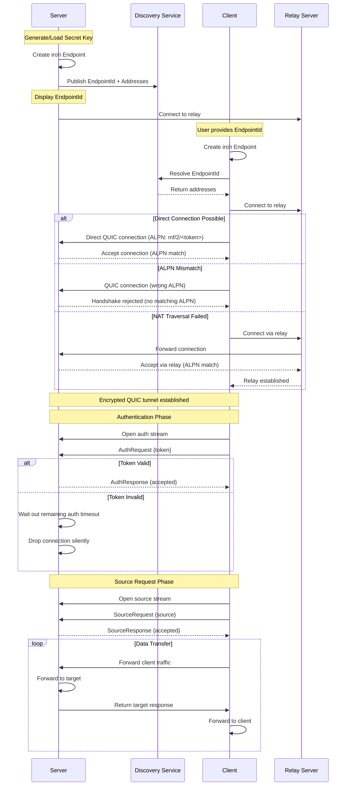

### TCP Tunnel Data Flow

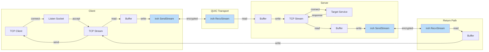

### UDP Tunnel Data Flow

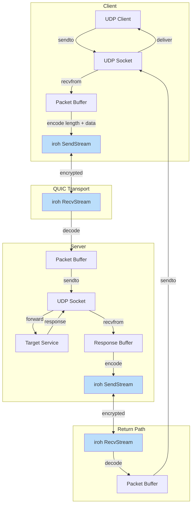

### Endpoint Management

```mermaid
graph TB
    subgraph "Endpoint Creation"
        A[Load/Generate Secret] --> B[Create Endpoint Builder]
        B --> C{Relay URLs?}
        C -->|Yes| D[Add Custom Relays]
        C -->|No| E[Use Default Relays]
        D --> F{Relay Only? (CLI-only)}
        E --> F
        F -->|Yes| G[Disable IP transports]
        F -->|No| H[Keep IP + relay transports]
        G --> I{DNS Server?}
        H --> I
        I -->|Yes| J[Add Custom DNS]
        I -->|No| K[Use Default DNS]
        J --> L[Build Endpoint]
        K --> L
    end

    subgraph "Discovery"
        L --> M[Publish to Pkarr/DNS]
        M --> N[Enable mDNS]
        N --> O[Endpoint Ready]
    end

    style A fill:#FFE0B2
    style L fill:#C8E6C9
    style O fill:#C8E6C9
```

---

## Configuration System

### Configuration File Structure

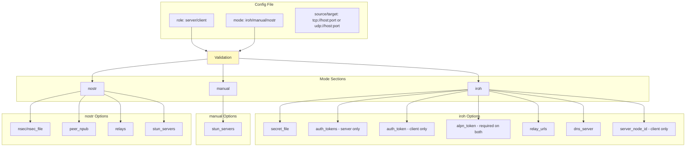

### iroh Credential Mapping

`iroh` mode uses two distinct credential types:

| Credential | CLI Flags | Config Keys | Expected Usage |
|------------|-----------|-------------|----------------|
| **ALPN Token** | Server: `--alpn-token`<br>Client: `--alpn-token` | Server/Client: `[iroh].alpn_token` | Pre-handshake QUIC ALPN filter (`mf/2/<token>`). Typically one shared value for a server and all its clients. |
| **Auth Token** | Server: `--auth-tokens` and/or `--auth-tokens-file`<br>Client: `--auth-token` or `--auth-token-file` | Server: `[iroh].auth_tokens` or `[iroh].auth_tokens_file`<br>Client: `[iroh].auth_token` or `[iroh].auth_token_file` | Per-client credential checked on the auth stream after handshake. Use separate values per client for revocation/rotation. |

Example CLI usage:

```bash
# Server
tunnel-rs server \
  --alpn-token "$ALPN_TOKEN" \
  --auth-tokens "$ALICE_AUTH_TOKEN" \
  --auth-tokens "$BOB_AUTH_TOKEN"

# Alice's client
tunnel-rs client \
  --alpn-token "$ALPN_TOKEN" \
  --auth-token "$ALICE_AUTH_TOKEN"
```

Example config usage:

```toml
# server.toml
[iroh]
alpn_token = "ALPN_TOKEN_SHARED_BY_ALL_CLIENTS"
auth_tokens = ["ALICE_AUTH_TOKEN", "BOB_AUTH_TOKEN"]

# client.toml
[iroh]
alpn_token = "ALPN_TOKEN_SHARED_BY_ALL_CLIENTS"
auth_token = "ALICE_AUTH_TOKEN"
```

### Configuration Loading Flow

For normal usage, prefer file-based configs (`-c`, `--default-config`) which use TOML — settings are saved and reusable. The `--config-stdin` flag is intended for automation and IPC only; it uses JSON because JSON is self-delimiting — `serde_json::from_reader` parses exactly one JSON object and returns without waiting for EOF, allowing the caller to keep stdin open (e.g., for manual mode signaling). Config passed via stdin is not persisted.

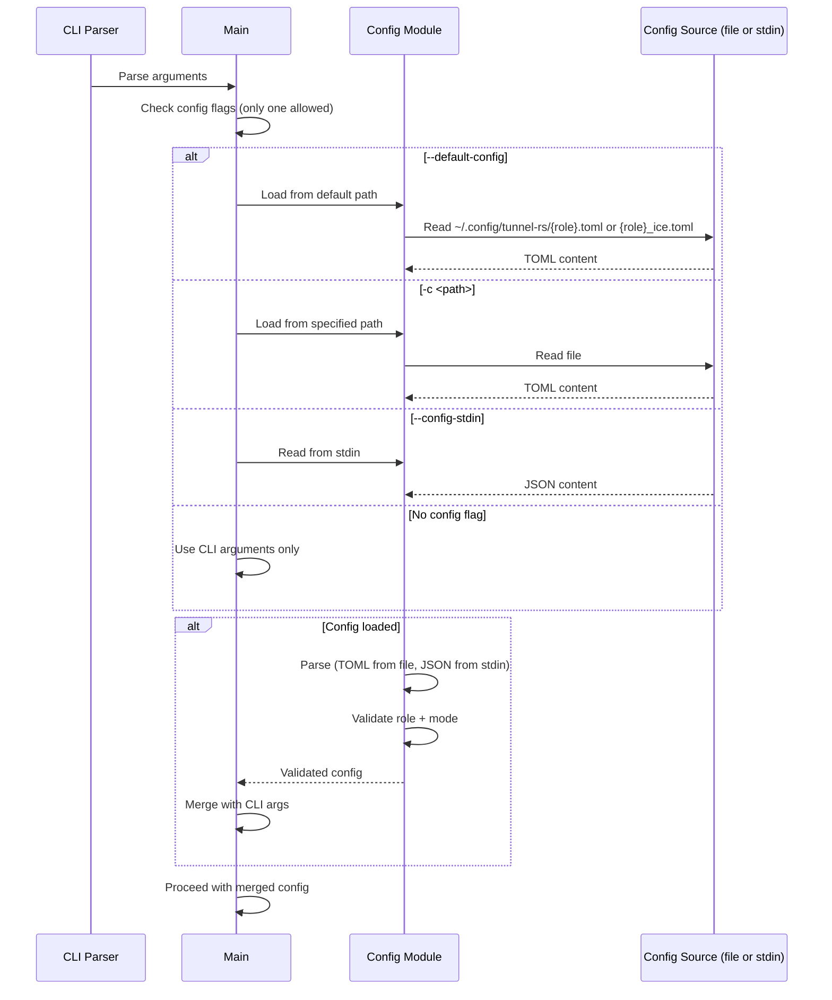

Note: For `tunnel-rs-ice`, the mode is inferred from the config file, so `server -c <file>` / `client -c <file>` can be used without a subcommand.

### Config Validation

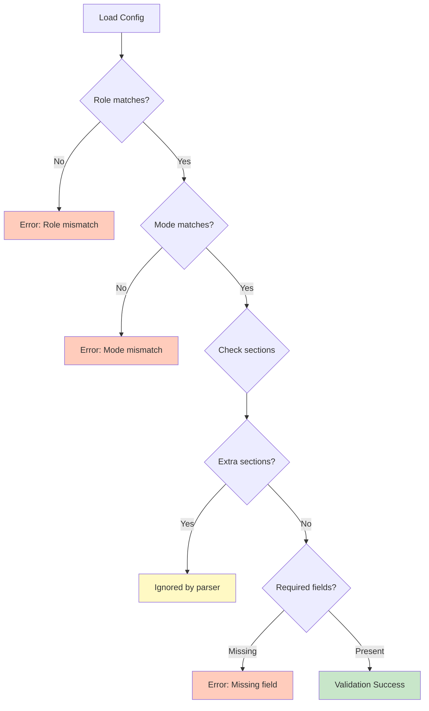

---

## Security Model

### Encryption Stack

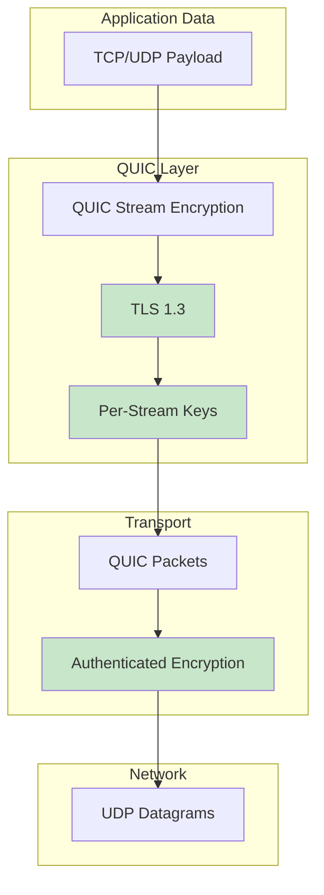

### Identity and Authentication

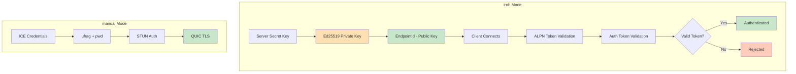

### Token Authentication (iroh Mode)

Iroh mode uses two layers of authentication. First, a pre-shared ALPN token is embedded in the QUIC protocol identifier (`mf/2/<token>`), rejecting unknown clients at the TLS handshake level before any application streams are opened. Second, clients must provide a valid auth token via a dedicated auth stream within a 10-second timeout. **Both layers are mandatory.**

#### ALPN Token vs Auth Token

- **ALPN Token** (`--alpn-token` / `[iroh].alpn_token`): Pre-handshake shared value used for QUIC ALPN filtering.
- **Auth Token** (server: `--auth-tokens` / `--auth-tokens-file`; client: `--auth-token` / `--auth-token-file`; config: `[iroh].auth_tokens` / `[iroh].auth_token`): Per-client token validated on the auth stream.
- **Mapping**: These are **distinct tokens**, not the same value. In code, ALPN tokens are 14-char Base64URL values, while auth tokens are 47-char `i...` tokens. Typical setup is one shared ALPN token plus per-client auth tokens for revocation.

1. **ALPN Filtering**: Both server and client specify `--alpn-token`. The token is embedded in the QUIC ALPN identifier (`mf/2/<token>`). Connections from clients without a matching ALPN are rejected at the handshake level — acting as a lightweight "port knock".
2. **Server Configuration**: Server specifies `--auth-tokens` with one or more pre-shared tokens
3. **Client Configuration**: Client specifies `--auth-token` with the token received from the server admin
4. **Protocol Flow**: Client opens a dedicated auth stream immediately after connection and sends an `AuthRequest`. **No source requests are accepted until authentication succeeds.**
5. **Validation**: Server validates the token using `is_token_valid()` within a 10-second timeout
6. **Rejection**: Invalid tokens are rejected with an `AuthResponse` containing the rejection reason, and the connection is closed with an error code.

This layered validation prevents unauthorized clients from holding open connections or attempting source requests.

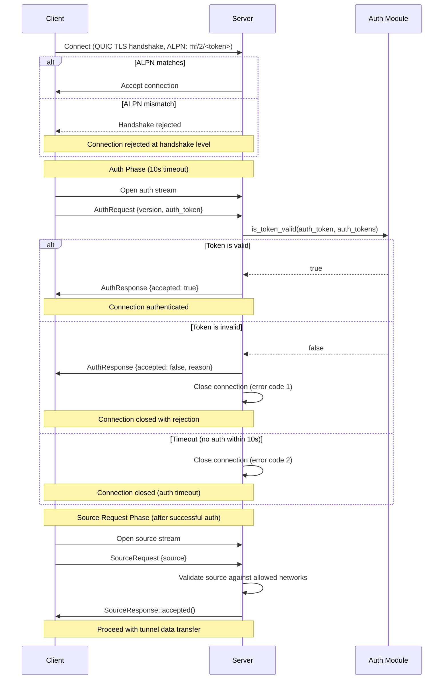

### Token Security Notes (iroh Mode)

- Tokens are **bearer credentials**: possession is sufficient for access. Use one token per client to enable revocation.
- Token strength comes from **randomness, not format**: 32 random bytes (256 bits of entropy). Treat tokens like high‑entropy secrets.
- Tokens are sent only **after** the QUIC/TLS 1.3 handshake, so the auth stream is encrypted in transit.
- The CRC16-CCITT-FALSE checksum is **for typo detection only**, not cryptographic security.
- Tokens are Base64URL-encoded and validated as ASCII.
- The **ALPN token** acts as a pre-handshake filter (lightweight "port knock"). It is embedded in the TLS ClientHello and therefore **visible in cleartext** on the wire — it is not a secret, but prevents casual scanners from completing a QUIC handshake.
- Avoid logging or sharing tokens; the `AuthToken` wrapper redacts values in Debug output, but treat them like passwords.
- Prefer token files with restricted permissions (e.g., `0600`) and rotate tokens if exposure is suspected.

### Threat Model

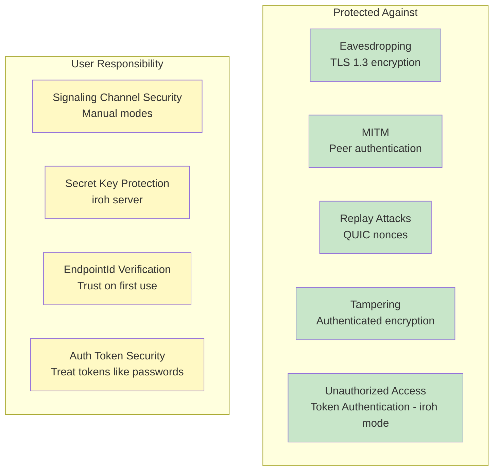

### Secret Key Management (Server Only)

In iroh mode, only the **server** needs a persistent secret key to maintain a stable EndpointId. Clients use ephemeral identities and authenticate via tokens.

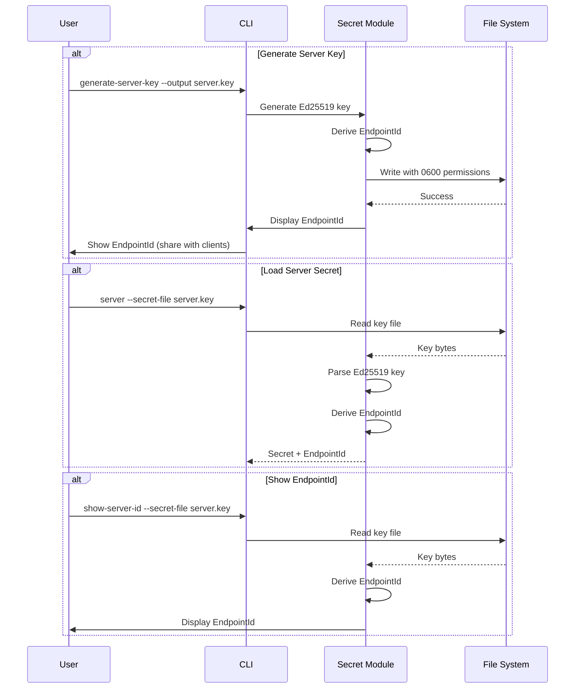

---

## Protocol Support

### TCP Tunneling Architecture

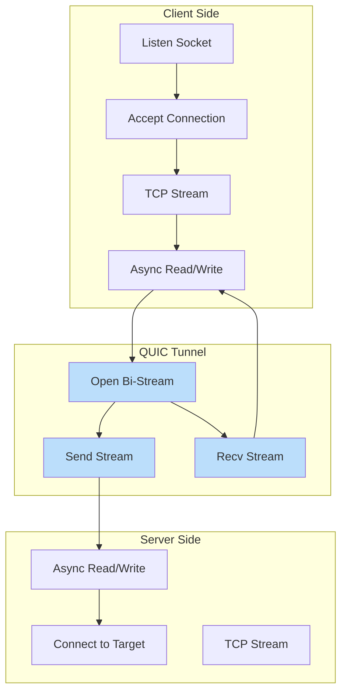

### UDP Tunneling Architecture

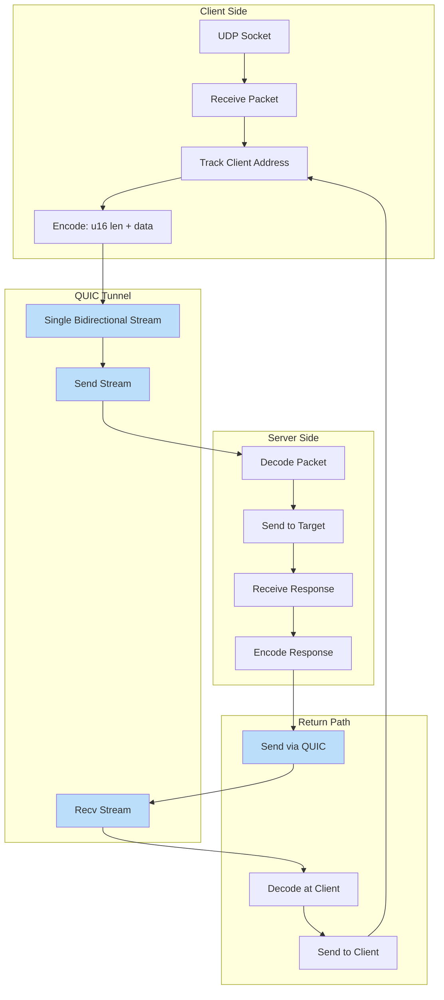

### UDP Packet Framing

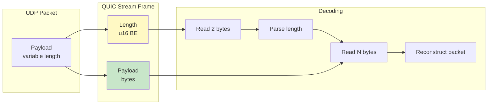

---

## Component Details

### IceAgent (str0m)

The `IceAgent` from str0m handles ICE connectivity establishment:

- **Candidate Gathering**: Discovers local and server-reflexive addresses
- **Connectivity Checks**: Performs STUN binding checks to all candidate pairs
- **Nomination**: Selects the best working candidate pair
- **Socket Management**: Provides the UDP socket for QUIC transport

### QUIC Endpoint (quinn)

The `quinn` QUIC implementation provides:

- **TLS 1.3**: Encrypted transport with certificate-based auth
- **Stream Multiplexing**: Multiple concurrent streams over one connection
- **Congestion Control**: Built-in congestion control and flow control
- **0-RTT**: Not currently enabled (future optimization)

### Endpoint (iroh)

The `iroh::Endpoint` provides:

- **Discovery**: Automatic peer discovery via Pkarr/DNS/mDNS
- **Relay**: Fallback relay servers for NAT traversal
- **QUIC**: Built-in QUIC transport with hole punching
- **Identity**: Ed25519-based peer identity and authentication

---

## Performance Considerations

### Connection Establishment Times

> **Note:** These are illustrative, environment-dependent ranges (network conditions, NAT type, relay availability, and DNS). Treat as rough guidance, not guarantees.

```mermaid
graph LR
    subgraph "iroh"
        A[Discovery: 1-3s]
        B[Connection: 0.5-2s]
        C[Total: 1.5-5s]
    end

    subgraph "manual"
        H[ICE Gather: 1-2s]
        I[Manual: User dependent]
        J[ICE Checks: 1-3s]
        K[QUIC: 0.5s]
        L[Total: 2.5-5.5s + manual]
    end

    style C fill:#FFF9C4
    style L fill:#FFF9C4
```

### Throughput Characteristics

- **TCP Tunneling**: Limited by QUIC stream flow control and congestion control
- **UDP Tunneling**: Additional framing overhead (2 bytes per packet)
- **Relay Mode**: Higher latency, potentially lower throughput
- **Direct Mode**: Near-native performance with encryption overhead

---

## Error Handling

### Connection Failures

```mermaid
graph TB
    A[Connection Attempt] --> B{Success?}
    B -->|Yes| C[Established]
    B -->|No| D{Mode?}
    
    D -->|iroh| E{Relay available?}
    E -->|Yes| F[Fallback to relay]
    E -->|No| G[Connection failed]

    D -->|manual| I[ICE checks failed]
    
    F --> C
    H --> G
    I --> G
    
    style C fill:#C8E6C9
    style F fill:#FFF9C4
    style G fill:#FFCCBC
```

### Exit Codes (Client Mode)

The client process uses categorized exit codes so wrapper scripts can distinguish
transient failures (retry) from permanent errors (stop):

| Code | Category | Examples |
|------|----------|---------|
| 0 | Success | Normal termination |
| 1 | General error | Unexpected/uncategorized failures |
| 2 | Configuration | Missing `--source`, invalid token format, bad ALPN |
| 3 | Authentication | Token rejected by server, auth response timeout |
| 10 | Connection failed | Relay timeout, endpoint offline, server unreachable |
| 11 | Connection lost | QUIC connection closed after tunnel was established |

Retry guidance:

- **Code 1** — Ambiguous. Retry a limited number of times with backoff; escalate if the error persists.
- **Codes 2, 3** — Do not retry. These require human intervention (fix config or credentials).
- **Code 10** — Connection establishment failed. Retry only if the tunnel has previously connected successfully (a prior exit 11 implies prior success).
- **Code 11** — Connection lost after the tunnel was working. Always safe to retry.

**Mode compatibility:** Auto-retry wrapper scripts work with **iroh mode** and **nostr mode**
(both use automatic signaling). **Manual mode** requires interactive copy-paste SDP exchange
each run, so auto-retry is not feasible.

### Stream Errors

- **TCP**: Connection reset, timeout → close QUIC stream
- **UDP**: Packet loss → no retry (UDP semantics preserved)
- **QUIC**: Stream reset → close local TCP connection or stop UDP forwarding

---

## Mode Capabilities

| Mode | Multi-Session | Dynamic Source | Encryption | Platform |
|------|---------------|----------------|------------|----------|
| `iroh` | **Yes** | **Yes** | QUIC/TLS 1.3 | Linux, macOS, Windows |
| `nostr` | **Yes** | **Yes** | QUIC/TLS 1.3 | Linux, macOS, Windows |
| `manual` | No | **Yes** | QUIC/TLS 1.3 | Linux, macOS, Windows |

**Multi-Session** = Multiple concurrent connections to the same server
**Dynamic Source** = Client specifies which service to tunnel (via `--source`)

---

## Current Limitations

### Single Session (Manual Signaling Mode)

The `manual` mode currently supports only one tunnel session at a time per server instance. Each signaling exchange establishes exactly one tunnel.

```mermaid
graph TB
    subgraph "manual Behavior"
        A[Server starts] --> B[Wait for client offer]
        B --> C[Validate source request]
        C --> D[Establish single tunnel]
        D --> E[Handle streams over this tunnel]
        E --> F[Additional clients timeout]
    end

    subgraph "Workarounds"
        G[Run multiple server instances]
        I[Use iroh mode]
    end

    style F fill:#FFCCBC
    style I fill:#C8E6C9
```

**Why this limitation exists:**
- Manual signaling mode performs a single offer/answer exchange
- The server enters a connection handling loop after establishing the tunnel
- No mechanism to accept additional signaling while serving existing tunnel

**Workarounds:**
- Use `iroh` mode for multi-client support
- Run separate server instances for each tunnel

Use `iroh` or `nostr` mode for multi-session support.

---

## References

- [iroh Documentation](https://iroh.computer/)
- [str0m ICE Implementation](https://github.com/algesten/str0m)
- [quinn QUIC Implementation](https://github.com/quinn-rs/quinn)
- [RFC 8445 - ICE](https://datatracker.ietf.org/doc/html/rfc8445)
- [RFC 9000 - QUIC](https://datatracker.ietf.org/doc/html/rfc9000)
