# tunnel-rs Architecture

This document provides a comprehensive overview of the tunnel-rs architecture, including detailed diagrams of component interactions, data flows, and security considerations.

## Table of Contents

- [System Overview](#system-overview)
- [Features](#features)
- [Tunnel Architecture](#tunnel-architecture)
- [Configuration System](#configuration-system)
- [Security Model](#security-model)
- [Protocol Support](#protocol-support)
- [Component Details](#component-details)
- [Performance Considerations](#performance-considerations)
- [Error Handling](#error-handling)
- [Capabilities](#capabilities)
- [References](#references)

---

## System Overview

tunnel-rs is a P2P TCP/UDP port forwarding tool using iroh for peer discovery, relay fallback, and encrypted QUIC transport.

Binary: `tunnel-rs`

> **Design Goal:** The project's primary goal is to provide a convenient way to connect to different networks for development or homelab purposes without the hassle and security risk of opening a port. It is **not** meant for production setups or designed to be performant at scale.

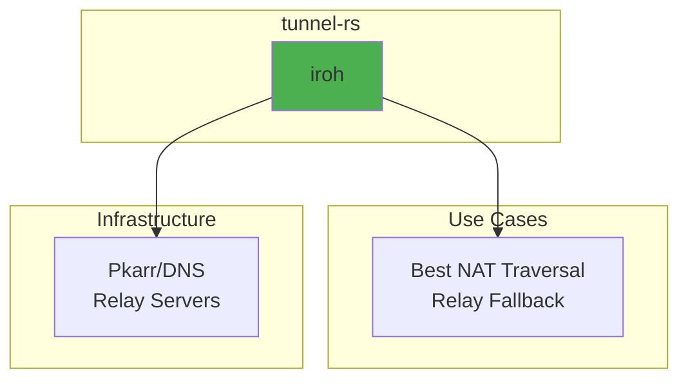

Relay-only is a CLI-only flag that forces connections through relay servers instead of attempting direct connections. It is intended for testing or special scenarios and is not supported in config files to avoid accidental activation. See `tunnel-rs --help` for usage.

### Core Components

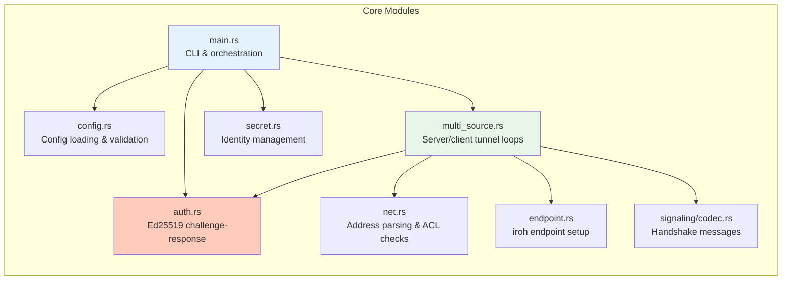

---

## Features

### Feature Summary

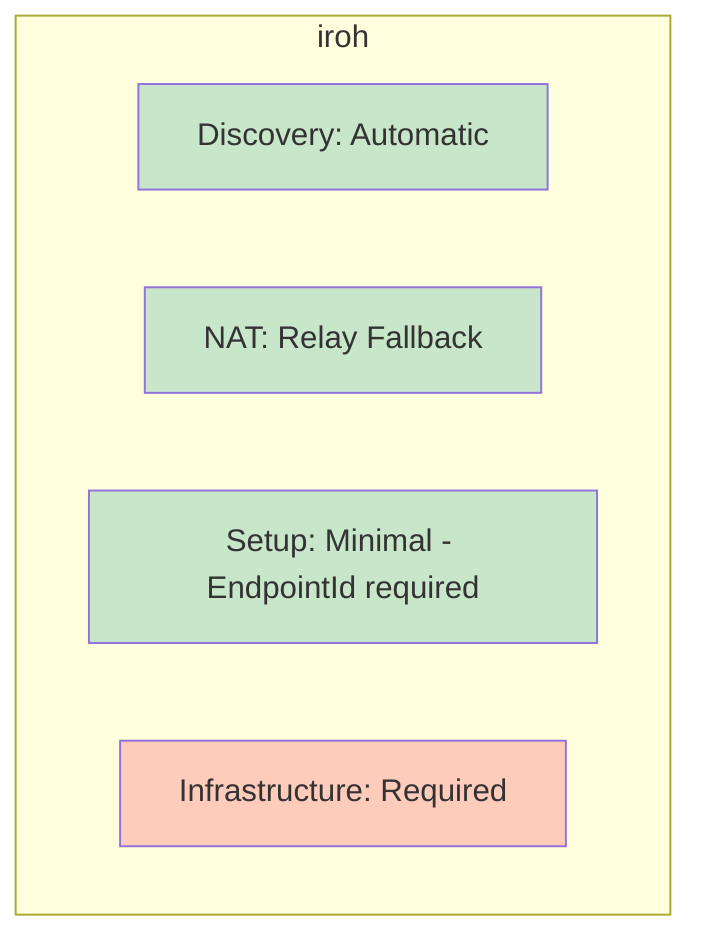

### NAT Traversal

Provided entirely by iroh and shared with ezvpn and flextunnel: which NAT types
reach a direct path, why symmetric NAT usually stays on the relay, why container
networking depends on the CNI rather than on Kubernetes itself, and what that
means for relay bandwidth. See
[NAT traversal and the QUIC transport](https://github.com/flexaccessdev/iroh-common-architecture/blob/main/nat-traversal-and-transport.md).

---

## Tunnel Architecture

### Architecture Overview

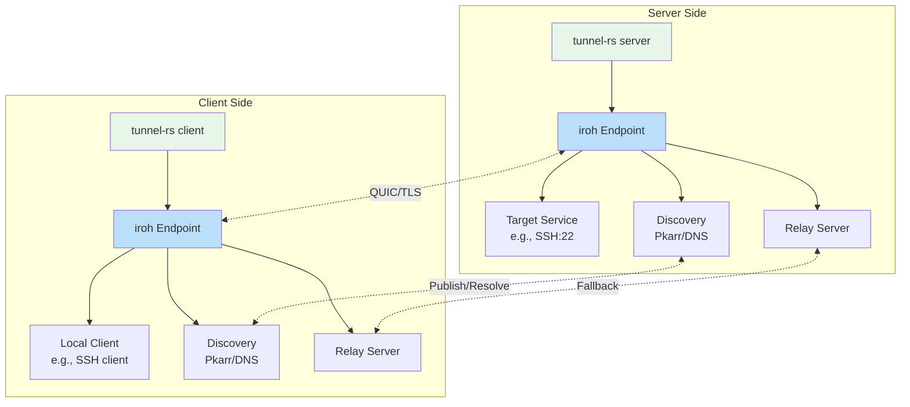

### Connection Establishment Flow

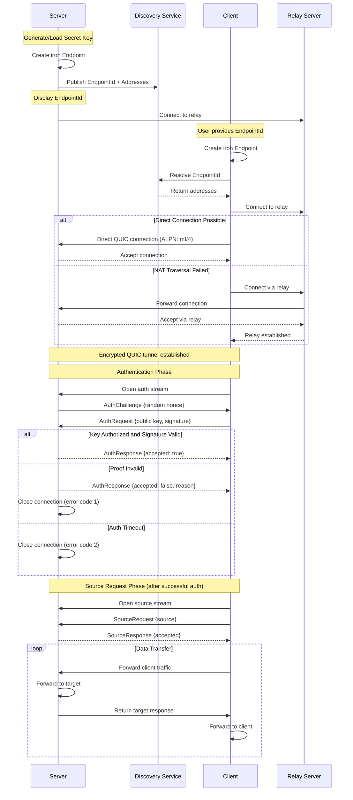

### TCP Tunnel Data Flow

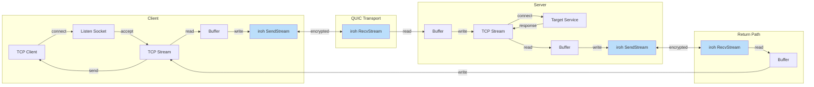

### UDP Tunnel Data Flow

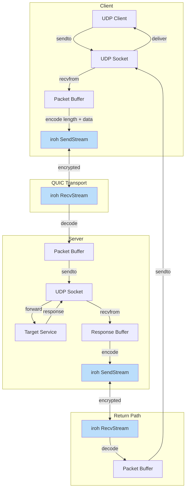

### Endpoint Management

The relay/discovery design is shared with ezvpn and flextunnel and is documented
once in
[iroh-common-architecture / relays-and-address-lookup.md](https://github.com/flexaccessdev/iroh-common-architecture/blob/main/relays-and-address-lookup.md).
In short: `RelayConfig` (`src/iroh_mode/endpoint.rs`) resolves the raw config
once into `Default` or `Custom`, and that single choice decides both the relay
map and whether n0 internet discovery runs. Discovery is not independently
configurable. Every custom relay is probed individually before the real endpoint
binds, and startup fails if any of them is unreachable.

```mermaid
graph TB
    subgraph "Endpoint Creation"
        A[Load/Generate Secret] --> B[Resolve RelayConfig]
        B --> C{Custom relay URLs?}
        C -->|Yes| D[Probe each relay in parallel<br/>all must come online]
        D --> D2[Custom relay map<br/>n0 discovery OFF]
        C -->|No| E[Default relay map<br/>n0 DNS lookup ON<br/>pkarr publish if persistent identity]
        D2 --> F{Relay Only? (CLI-only)}
        E --> F
        F -->|Yes| G[Clear IP transports<br/>no address lookup at all]
        F -->|No| H[Keep IP + relay transports<br/>enable mDNS]
        G --> L[Build + bind Endpoint]
        H --> L
        L --> O[Wait for online, then Ready]
    end

    style A fill:#FFE0B2
    style L fill:#C8E6C9
    style O fill:#C8E6C9
```

---

## Configuration System

### Configuration File Structure

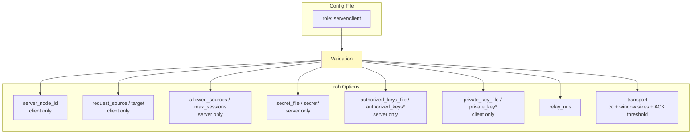

`*` marks the inline key forms: a TOML config file carries only the `_file`
paths, while a JSON `--config-stdin` config may carry either. Every other field
is the same in both formats.

### Credential Mapping

tunnel-rs authenticates clients with separate Ed25519 keys. The QUIC ALPN is a fixed value (`mf/4`) shared by all peers and is not configurable; access control happens on the first application stream after the iroh handshake.

| Credential | Env Vars / CLI Flags | Config Key | Expected Usage |
|------------|-----------|-------------|----------------|
| **Client Auth Key** | Server: `TUNNEL_RS_AUTHORIZED_KEYS_FILE` or `--authorized-keys-file`<br>Client: `TUNNEL_RS_PRIVATE_KEY_FILE` or `--private-key-file` | Server: `[iroh].authorized_keys_file`<br>Client: `[iroh].private_key_file` | The client signs a fresh server challenge. The key is not used as the iroh transport identity. |

Example usage with files (recommended):

```bash
# Alice — generate a compact private key with the flexaccess-keys CLI,
# then derive its public entry
flexaccess-keys generate-auth-key alice --output alice.key
flexaccess-keys show-auth-key --private-key-file alice.key > alice.pub

# Alice — reprint that entry later, straight from the private key
flexaccess-keys show-auth-key --private-key-file ./alice.key

# Server — authorize the public entry
cat alice.pub >> authorized_keys
tunnel-rs server --authorized-keys-file ./authorized_keys ...

# Alice's client
tunnel-rs client --private-key-file ./alice.key ...
```

Example config usage:

```toml
# server.toml — using _file variants
[iroh]
authorized_keys_file = "/etc/tunnel-rs/authorized_keys"

# client.toml — using _file variants
[iroh]
private_key_file = "~/.config/tunnel-rs/client.key"
```

A JSON stdin config may instead carry the keys themselves — `authorized_keys`
(an array of authorized-keys lines) on the server and `private_key` (the bare
token or a whole key file) on the client. Those inline forms are rejected in
TOML, where they would outlive the process in VCS and backups.

### Configuration Loading Flow

For normal usage, prefer file-based configs (`-c`, `--default-config`) which use TOML — settings are saved and reusable. The `--config-stdin` flag is intended for automation and IPC only; it uses JSON because JSON is self-delimiting — `serde_json::from_reader` parses exactly one JSON object and returns without waiting for EOF, allowing the caller to keep stdin open. Config passed via stdin is not persisted.

Both formats reject unknown fields, so a misspelled key fails at startup instead of silently doing nothing.

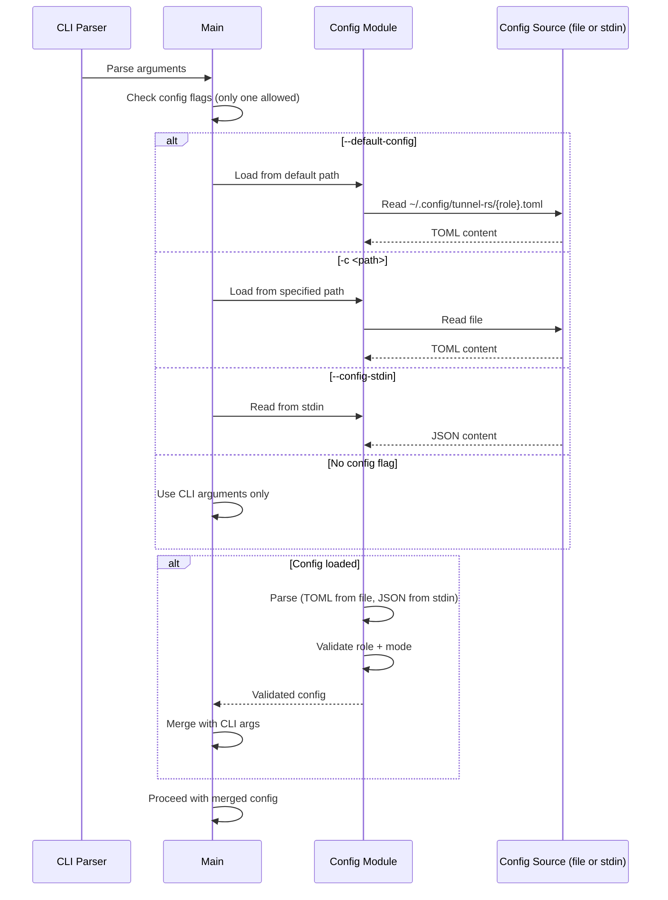

### Config Validation

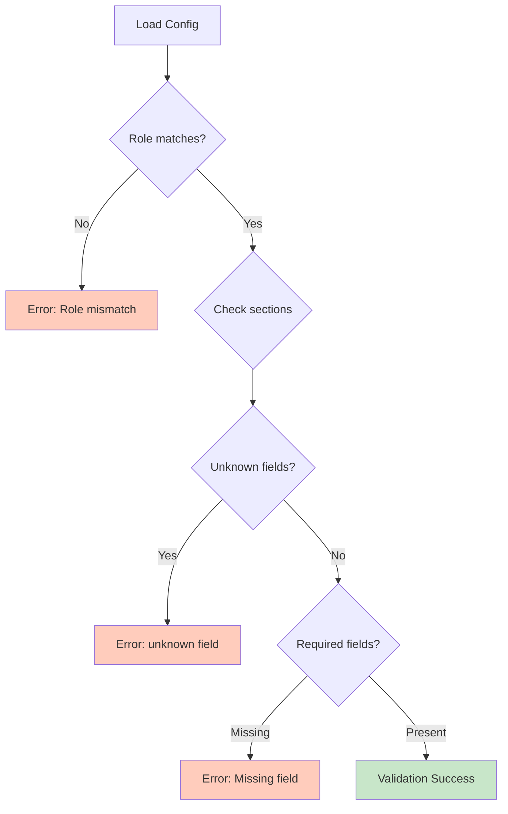

---

## Security Model

### Encryption Stack

All traffic is end-to-end encrypted by QUIC/TLS 1.3 between the two endpoints;
relay operators forward ciphertext and see only connection metadata. The stack is
iroh's and identical across tunnel-rs, ezvpn, and flextunnel — see
[NAT traversal and the QUIC transport](https://github.com/flexaccessdev/iroh-common-architecture/blob/main/nat-traversal-and-transport.md#encryption-stack).

ALPN is split between the two layers. The *mechanism* — carrying the protocol
identifier in the TLS 1.3 handshake and failing the connection when the two sides
disagree — is TLS's, and iroh exposes it as the ALPN passed to
`Endpoint::connect` and `alpns()`. The *value* is tunnel-rs's own choice: the
fixed `mf/4` (`TUNNEL_ALPN` in `src/iroh_mode/endpoint.rs`), shared by every
tunnel-rs peer and not configurable, which keeps peers of the other two programs
from completing a handshake at all. It is not a secret and grants nothing; the
Ed25519 challenge-response below is what authorizes the *user* rather than the
endpoint.

### Identity and Authentication

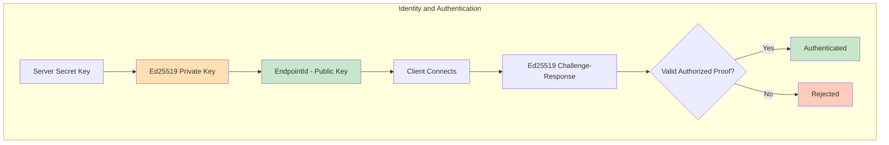

### Ed25519 Public-Key Authentication

The QUIC ALPN remains the fixed value `mf/4`. Once the iroh connection is
established, the client opens a dedicated authentication stream. The server
issues a fresh 32-byte random challenge, and the client signs a
domain-separated transcript with its Ed25519 authentication key. This key is
separate from the ephemeral iroh client identity.

1. **Shared key layer**: [`flexaccess-keys`](https://github.com/flexaccessdev/flexaccess-keys) owns the app-independent `ed25519-sec:` / `ed25519-pub:` format, secure key-file output, authorized-key parsing, raw Ed25519 operations, and the key-management CLI (`flexaccess-keys generate-auth-key` / `show-auth-key`). tunnel-rs has no key-management commands of its own.
2. **Configuration**: `authorized_keys_file` points to shared-format public entries, and `private_key_file` points to the compact private-key file generated by `flexaccess-keys generate-auth-key`.
3. **Protocol Flow**: The server sends `AuthChallenge`; the client returns `AuthRequest { public_key, signature }`. **No source requests are accepted until authentication succeeds.**
4. **Validation**: `auth.rs` checks that the public key is authorized and strictly verifies the Ed25519 signature within the 10-second auth timeout.
5. **Rejection**: Unknown keys, malformed proofs, and invalid signatures close the connection with an authentication error.

This validation prevents unauthorized clients from holding open connections or attempting source requests.

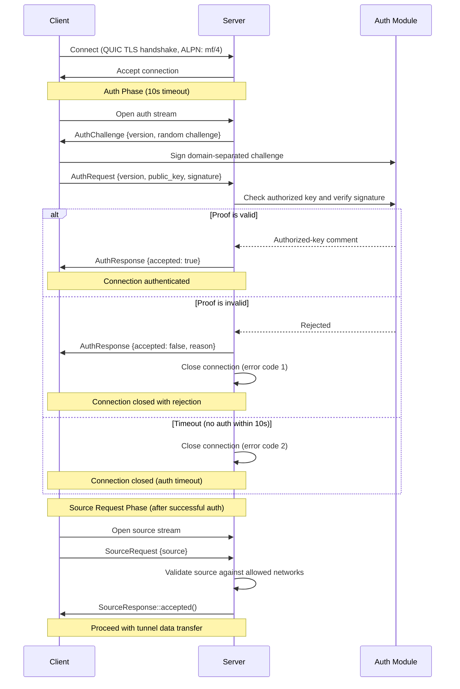

### Public-Key Authentication Security Notes

- The private key never crosses the wire; only its public key and a signature over a fresh challenge are sent.
- A new random challenge prevents replaying a proof from another connection.
- Domain separation prevents the signature from being valid for an unrelated Ed25519 protocol.
- Removing a public entry from `authorized_keys` revokes that client after the server is restarted.
- Compact private-key files are created with `0600` permissions on Unix and include their public entry as a comment for administration. Server secret key files carry the same headers, naming their EndpointId; comment lines are skipped when a key is loaded, so a whole key file is also accepted as an inline `secret`.
- The fixed `mf/4` ALPN is not a secret and is unchanged by the authentication mechanism.

### Threat Model

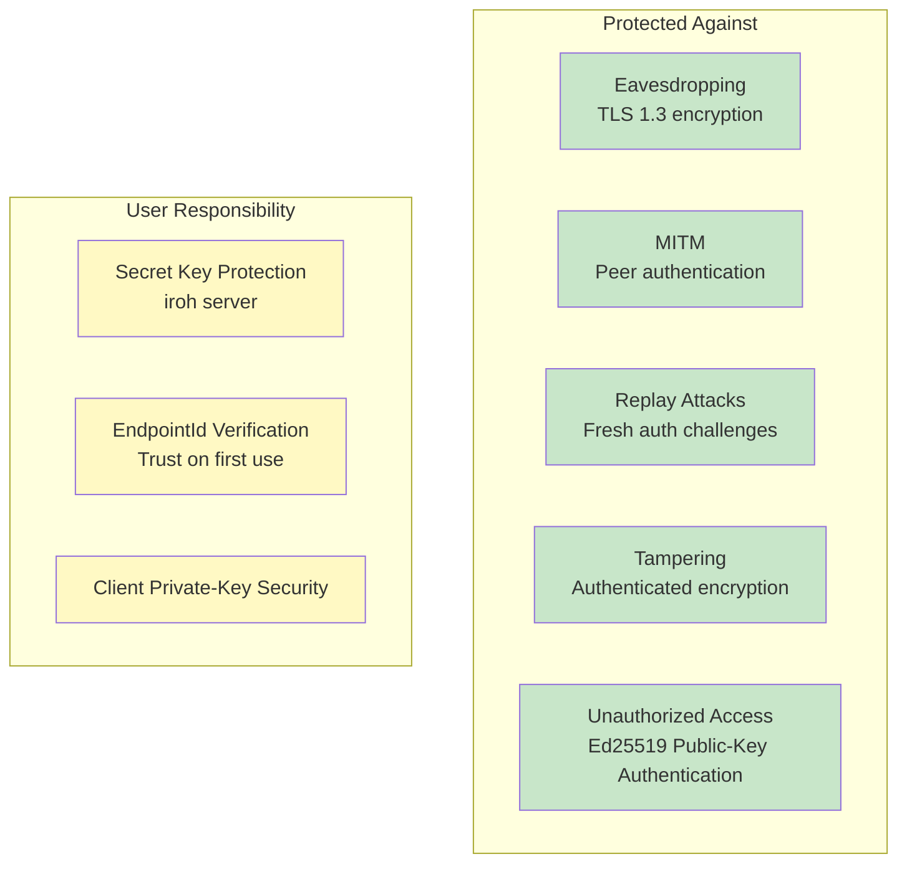

### Secret Key Management (Server Only)

Only the **server** needs a persistent transport secret key to maintain a stable EndpointId. Clients use ephemeral iroh identities. Their separate persistent Ed25519 keys are used only for application authentication after the transport handshake.

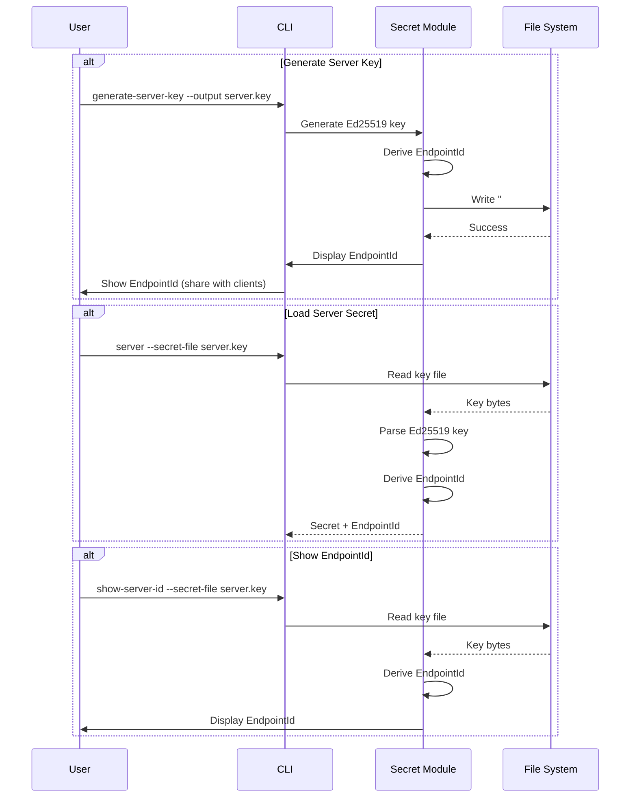

---

## Protocol Support

### TCP Tunneling Architecture

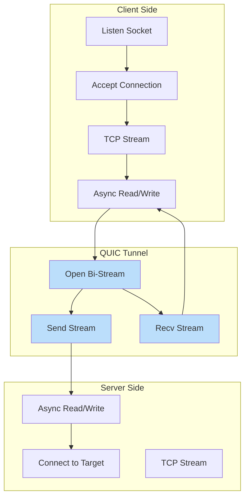

### UDP Tunneling Architecture

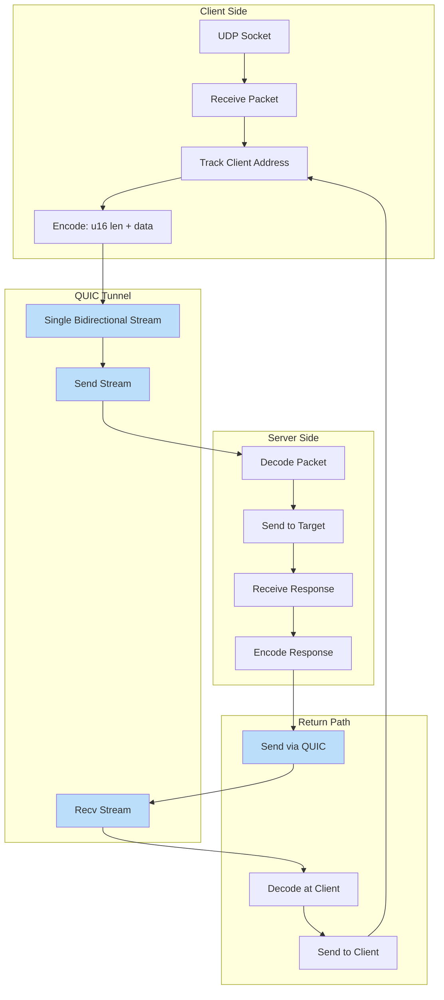

### UDP Packet Framing

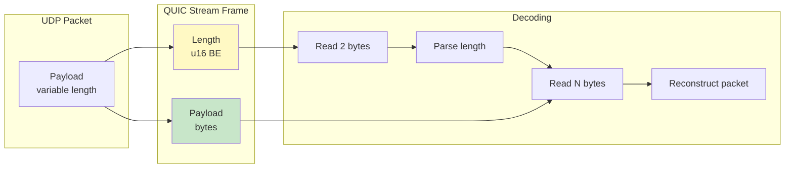

---

## Component Details

### Endpoint (iroh)

`iroh::Endpoint` supplies discovery, NAT traversal, relay fallback, the QUIC
transport, and Ed25519 endpoint identity. tunnel-rs configures it in
`src/iroh_mode/endpoint.rs` and adds nothing to the transport itself. For what
the endpoint does and how it behaves, see
[NAT traversal and the QUIC transport](https://github.com/flexaccessdev/iroh-common-architecture/blob/main/nat-traversal-and-transport.md)
and
[relays and address lookup](https://github.com/flexaccessdev/iroh-common-architecture/blob/main/relays-and-address-lookup.md).

---

## Performance Considerations

### Connection Establishment Times

Establishment timings (discovery, hole punching, relay fallback) are iroh's and
shared across the three programs — see
[performance characteristics](https://github.com/flexaccessdev/iroh-common-architecture/blob/main/nat-traversal-and-transport.md#performance-characteristics).

### Throughput Characteristics

Specific to tunnel-rs's tunneling layer:

- **TCP Tunneling**: Limited by QUIC stream flow control, congestion control, and optional ACK frequency tuning
- **UDP Tunneling**: Additional framing overhead (2 bytes per packet)

Direct-vs-relay path performance is a property of the iroh transport — see
[performance characteristics](https://github.com/flexaccessdev/iroh-common-architecture/blob/main/nat-traversal-and-transport.md#performance-characteristics).

---

## Error Handling

Connection establishment and its relay fallback are handled by iroh (see
[NAT traversal and the QUIC transport](https://github.com/flexaccessdev/iroh-common-architecture/blob/main/nat-traversal-and-transport.md)).
What follows is how tunnel-rs surfaces the outcome.

### Exit Codes (Client Mode)

The client process uses categorized exit codes so wrapper scripts can distinguish
transient failures (retry) from permanent errors (stop):

| Code | Category | Examples |
|------|----------|---------|
| 0 | Success | Normal termination |
| 1 | General error | Unexpected/uncategorized failures |
| 2 | Configuration | Missing `--source`, invalid key format |
| 3 | Authentication | Signature rejected by server, auth response timeout |
| 10 | Connection failed | Relay timeout, endpoint offline, server unreachable |
| 11 | Connection lost | QUIC connection closed after tunnel was established |

Retry guidance:

- **Code 1** — Ambiguous. Retry a limited number of times with backoff; escalate if the error persists.
- **Codes 2, 3** — Do not retry. These require human intervention (fix config or credentials).
- **Code 10** — Connection establishment failed. Retry only if the tunnel has previously connected successfully.
- **Code 11** — Connection lost after the tunnel was working. Always safe to retry.

### Stream Errors

- **TCP**: Connection reset, timeout → close QUIC stream
- **UDP**: Packet loss → no retry (UDP semantics preserved)
- **QUIC**: Stream reset → close local TCP connection or stop UDP forwarding

---

## Capabilities

| Feature | Support |
|---------|---------|
| Multi-Session | **Yes** - Multiple concurrent connections to the same server |
| Dynamic Source | **Yes** - Client specifies which service to tunnel (via `--source`) |
| Encryption | QUIC/TLS 1.3 |
| Platform | Linux, macOS, Windows |

---

## References

- [iroh-common-architecture](https://github.com/flexaccessdev/iroh-common-architecture) —
  shared iroh transport design for tunnel-rs, ezvpn, and flextunnel: [NAT
  traversal and the QUIC transport](https://github.com/flexaccessdev/iroh-common-architecture/blob/main/nat-traversal-and-transport.md),
  [relays and address lookup](https://github.com/flexaccessdev/iroh-common-architecture/blob/main/relays-and-address-lookup.md),
  [relay self-hosting](https://github.com/flexaccessdev/iroh-common-architecture/blob/main/self-hosting.md),
  the discovery findings, and the relay connection trace
- [iroh Documentation](https://iroh.computer/)
- [RFC 9000 - QUIC](https://datatracker.ietf.org/doc/html/rfc9000)
