# tunnel-rs Architecture

This document provides a comprehensive overview of the tunnel-rs architecture, including detailed diagrams of component interactions, data flows, and security considerations.

## Table of Contents

- [System Overview](#system-overview)
- [Features](#features)
- [iroh Mode Architecture](#iroh-mode-architecture)
- [Configuration System](#configuration-system)
- [Security Model](#security-model)
- [Protocol Support](#protocol-support)
- [Component Details](#component-details)
- [Performance Considerations](#performance-considerations)
- [Error Handling](#error-handling)
- [Capabilities](#capabilities)
- [References](#references)

---

## System Overview

tunnel-rs is a P2P TCP/UDP port forwarding tool using iroh for peer discovery, relay fallback, and encrypted QUIC transport.

Binary: `tunnel-rs`

> **Design Goal:** The project's primary goal is to provide a convenient way to connect to different networks for development or homelab purposes without the hassle and security risk of opening a port. It is **not** meant for production setups or designed to be performant at scale.

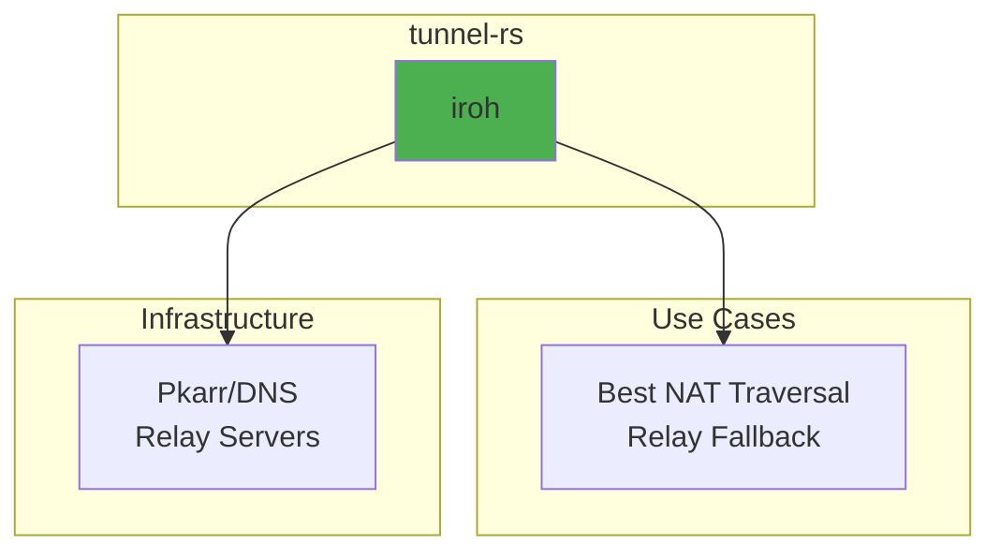

Relay-only is a CLI-only flag that forces connections through relay servers instead of attempting direct connections. It is intended for testing or special scenarios and is not supported in config files to avoid accidental activation. See `tunnel-rs --help` for usage.

### Core Components

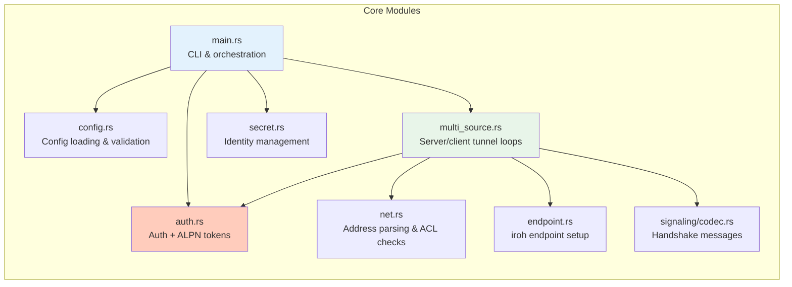

---

## Features

### Feature Summary

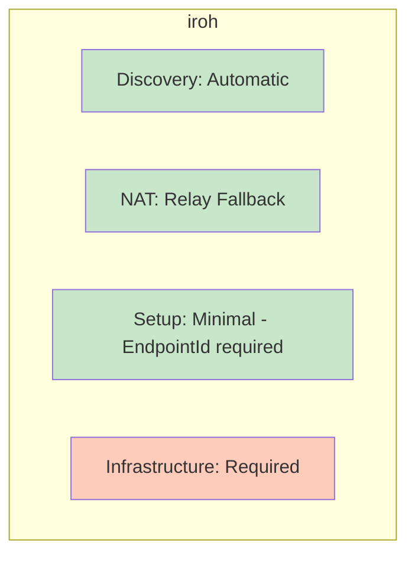

### NAT Traversal Capabilities

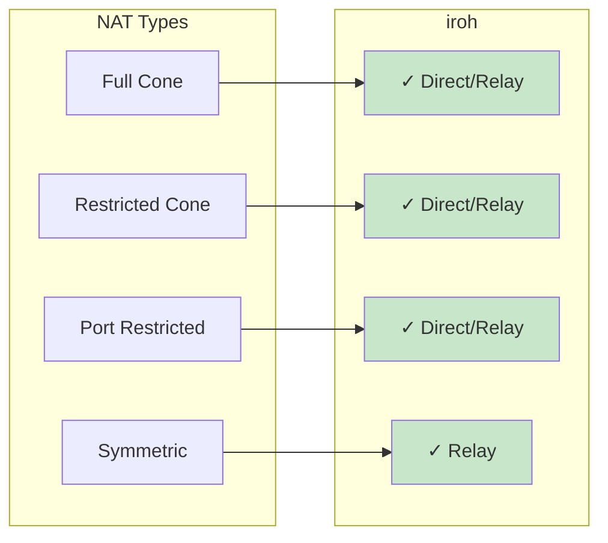

---

## iroh Mode Architecture

### Architecture Overview

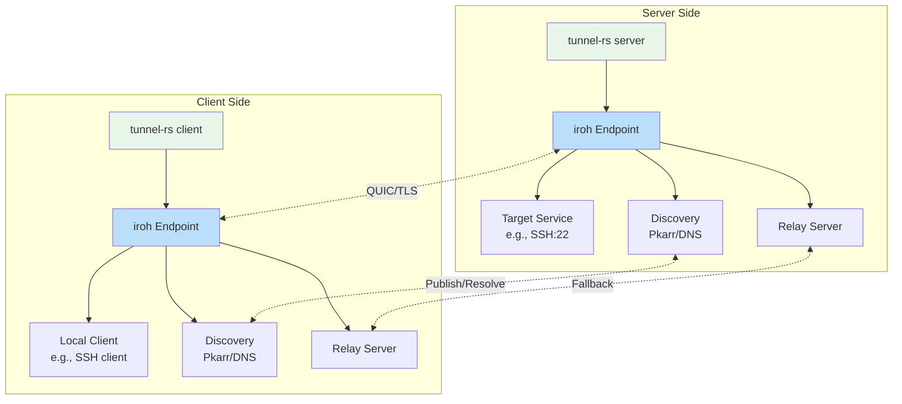

### Connection Establishment Flow


### TCP Tunnel Data Flow

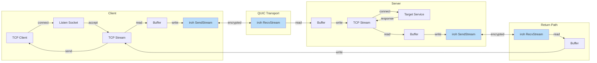

### UDP Tunnel Data Flow

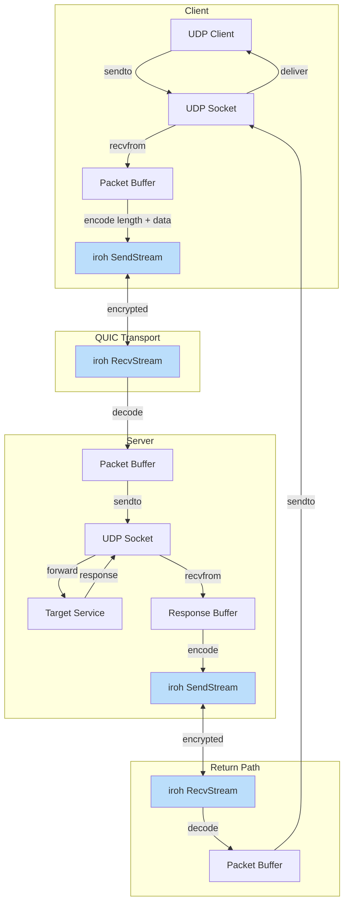

### Endpoint Management

```mermaid
graph TB
    subgraph "Endpoint Creation"
        A[Load/Generate Secret] --> B[Create Endpoint Builder]
        B --> C{Relay URLs?}
        C -->|Yes| D[Add Custom Relays]
        C -->|No| E[Use Default Relays]
        D --> F{Relay Only? (CLI-only)}
        E --> F
        F -->|Yes| G[Disable IP transports]
        F -->|No| H[Keep IP + relay transports]
        G --> I{DNS Server?}
        H --> I
        I -->|Yes| J[Add Custom DNS]
        I -->|No| K[Use Default DNS]
        J --> L[Build Endpoint]
        K --> L
    end

    subgraph "Discovery"
        L --> M[Publish to Pkarr/DNS]
        M --> N[Enable mDNS]
        N --> O[Endpoint Ready]
    end

    style A fill:#FFE0B2
    style L fill:#C8E6C9
    style O fill:#C8E6C9
```

---

## Configuration System

### Configuration File Structure

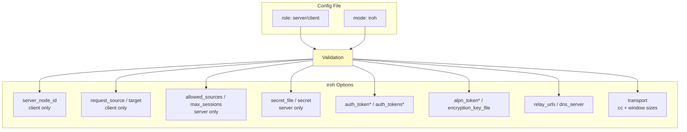

### iroh Credential Mapping

`iroh` mode uses two distinct credential types:

| Credential | Env Vars / CLI Flags | Config Keys (TOML: use `_file` variants or age-encrypted inline) | Expected Usage |
|------------|-----------|-------------|----------------|
| **ALPN Token** | `TUNNEL_RS_ALPN_TOKEN` or `--alpn-token-file` | Server/Client: `[iroh].alpn_token_file` or age-encrypted `[iroh].alpn_token` | Pre-handshake QUIC ALPN filter (`mf/2/<token>`). Typically one shared value for a server and all its clients. |
| **Auth Token** | Server: `TUNNEL_RS_AUTH_TOKENS` or `--auth-tokens-file`<br>Client: `TUNNEL_RS_AUTH_TOKEN` or `--auth-token-file` | Server: `[iroh].auth_tokens_file` or age-encrypted `[iroh].auth_tokens`<br>Client: `[iroh].auth_token_file` or age-encrypted `[iroh].auth_token` | Per-client credential checked on the auth stream after handshake. Use separate values per client for revocation/rotation. |

Example usage with files (recommended):

```bash
# Server — save tokens to files with restricted permissions
echo "$ALPN_TOKEN" > alpn_token.txt && chmod 600 alpn_token.txt
printf '%s\n' "$ALICE_AUTH_TOKEN" "$BOB_AUTH_TOKEN" > auth_tokens.txt && chmod 600 auth_tokens.txt
tunnel-rs server --alpn-token-file ./alpn_token.txt --auth-tokens-file ./auth_tokens.txt ...

# Alice's client
echo "$ALICE_AUTH_TOKEN" > auth_token.txt && chmod 600 auth_token.txt
tunnel-rs client --alpn-token-file ./alpn_token.txt --auth-token-file ./auth_token.txt ...
```

Example usage with environment variables (for containers/automation):

```bash
# Server
export TUNNEL_RS_ALPN_TOKEN="$ALPN_TOKEN"
export TUNNEL_RS_AUTH_TOKENS="$ALICE_AUTH_TOKEN,$BOB_AUTH_TOKEN"
tunnel-rs server ...

# Alice's client
export TUNNEL_RS_ALPN_TOKEN="$ALPN_TOKEN"
export TUNNEL_RS_AUTH_TOKEN="$ALICE_AUTH_TOKEN"
tunnel-rs client ...
```

Example config usage (plaintext tokens are not allowed in TOML config files — use `_file` variants or age-encrypted inline values):

```toml
# server.toml — using _file variants
[iroh]
alpn_token_file = "/etc/tunnel-rs/alpn_token.txt"
auth_tokens_file = "/etc/tunnel-rs/auth_tokens.txt"

# client.toml — using _file variants
[iroh]
alpn_token_file = "~/.config/tunnel-rs/alpn_token.txt"
auth_token_file = "~/.config/tunnel-rs/token.txt"
```

```toml
# client.toml — using age-encrypted inline values
[iroh]
encryption_key_file = "~/.config/tunnel-rs/age.key"

auth_token = "ageenc:YWdlLWVuY3J5cHRpb24ub3JnL3Yx..."
alpn_token = "ageenc:YWdlLWVuY3J5cHRpb24ub3JnL3Yx..."
```

### Configuration Loading Flow

For normal usage, prefer file-based configs (`-c`, `--default-config`) which use TOML — settings are saved and reusable. The `--config-stdin` flag is intended for automation and IPC only; it uses JSON because JSON is self-delimiting — `serde_json::from_reader` parses exactly one JSON object and returns without waiting for EOF, allowing the caller to keep stdin open. Config passed via stdin is not persisted.

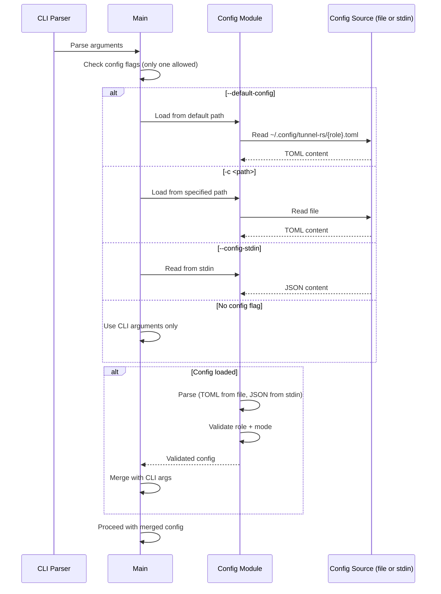

### Config Validation

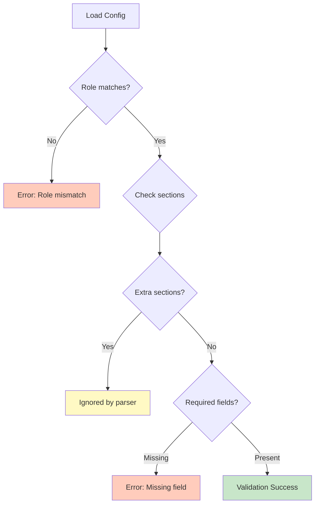

---

## Security Model

### Encryption Stack

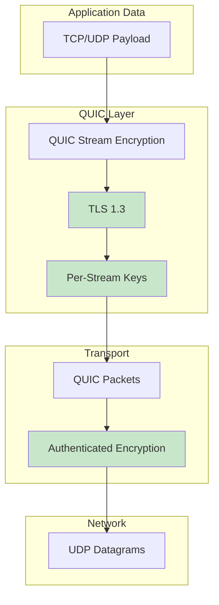

### Identity and Authentication

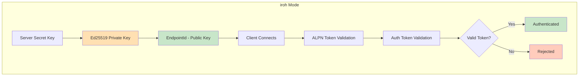

### Token Authentication (iroh Mode)

Iroh mode uses two layers of authentication. First, a pre-shared ALPN token is embedded in the QUIC protocol identifier (`mf/2/<token>`), rejecting unknown clients at the TLS handshake level before any application streams are opened. Second, clients must provide a valid auth token via a dedicated auth stream within a 10-second timeout. **Both layers are mandatory.**

#### ALPN Token vs Auth Token

- **ALPN Token** (`TUNNEL_RS_ALPN_TOKEN` env var / `--alpn-token-file` / `[iroh].alpn_token_file`): Pre-handshake shared value used for QUIC ALPN filtering.
- **Auth Token** (server: `TUNNEL_RS_AUTH_TOKENS` env var / `--auth-tokens-file` / `[iroh].auth_tokens_file`; client: `TUNNEL_RS_AUTH_TOKEN` env var / `--auth-token-file` / `[iroh].auth_token_file`): Per-client token validated on the auth stream.
- **Mapping**: These are **distinct tokens**, not the same value. In code, ALPN tokens are 14-char Base64URL values, while auth tokens are 47-char `i...` tokens. Typical setup is one shared ALPN token plus per-client auth tokens for revocation.

1. **ALPN Filtering**: Both server and client set `TUNNEL_RS_ALPN_TOKEN`. The token is embedded in the QUIC ALPN identifier (`mf/2/<token>`). Connections from clients without a matching ALPN are rejected at the handshake level — acting as a lightweight "port knock".
2. **Server Configuration**: Server sets `TUNNEL_RS_AUTH_TOKENS` with one or more pre-shared tokens (comma-separated)
3. **Client Configuration**: Client sets `TUNNEL_RS_AUTH_TOKEN` with the token received from the server admin
4. **Protocol Flow**: Client opens a dedicated auth stream immediately after connection and sends an `AuthRequest`. **No source requests are accepted until authentication succeeds.**
5. **Validation**: Server validates the token using `is_token_valid()` within a 10-second timeout
6. **Rejection**: Invalid tokens are rejected with an `AuthResponse` containing the rejection reason, and the connection is closed with an error code.

This layered validation prevents unauthorized clients from holding open connections or attempting source requests.

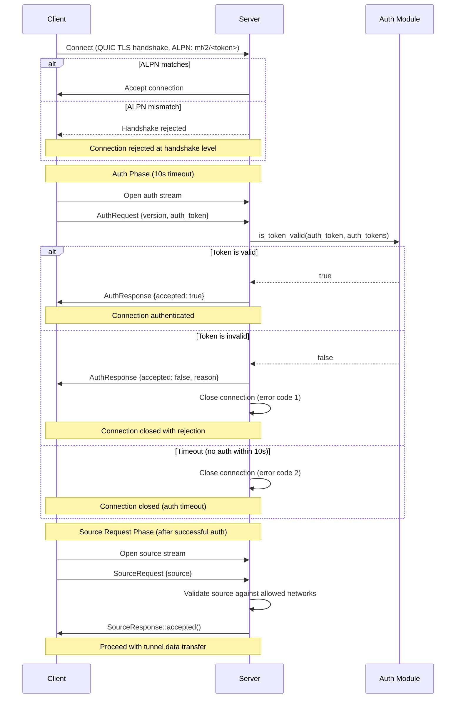

### Token Security Notes (iroh Mode)

- Tokens are **bearer credentials**: possession is sufficient for access. Use one token per client to enable revocation.
- Token strength comes from **randomness, not format**: 32 random bytes (256 bits of entropy). Treat tokens like high‑entropy secrets.
- Tokens are sent only **after** the QUIC/TLS 1.3 handshake, so the auth stream is encrypted in transit.
- The CRC16-CCITT-FALSE checksum is **for typo detection only**, not cryptographic security.
- Tokens are Base64URL-encoded and validated as ASCII.
- The **ALPN token** acts as a pre-handshake filter (lightweight "port knock"). It is embedded in the TLS ClientHello and therefore **visible in cleartext** on the wire — it is not a secret, but prevents casual scanners from completing a QUIC handshake.
- Avoid logging or sharing tokens; the `AuthToken` wrapper redacts values in Debug output, but treat them like passwords.
- Prefer token files with restricted permissions (e.g., `0600`) and rotate tokens if exposure is suspected.

### Threat Model

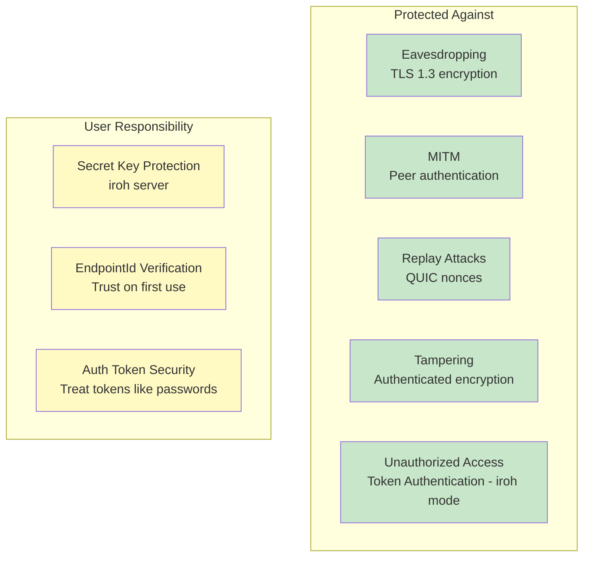

### Secret Key Management (Server Only)

In iroh mode, only the **server** needs a persistent secret key to maintain a stable EndpointId. Clients use ephemeral identities and authenticate via tokens.

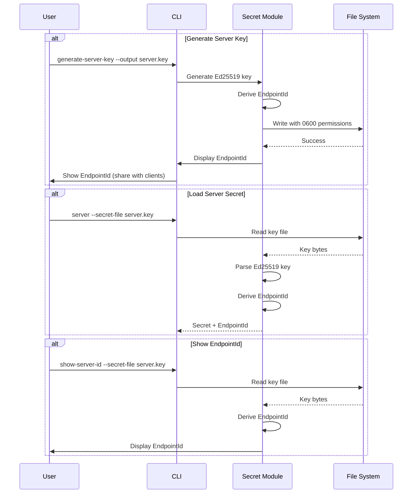

---

## Protocol Support

### TCP Tunneling Architecture

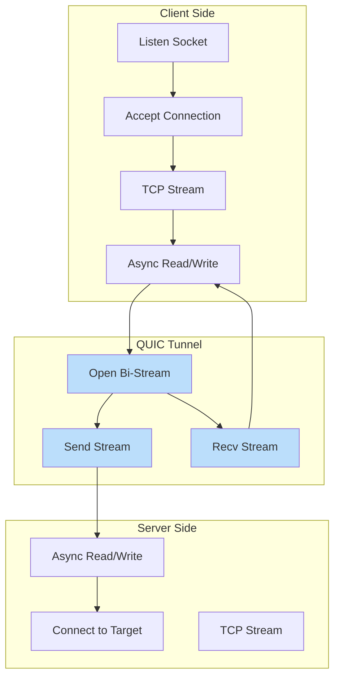

### UDP Tunneling Architecture

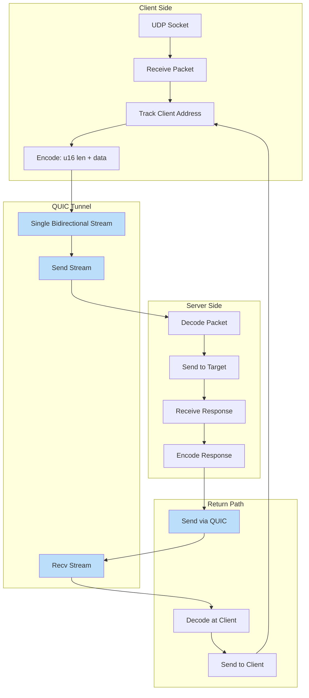

### UDP Packet Framing

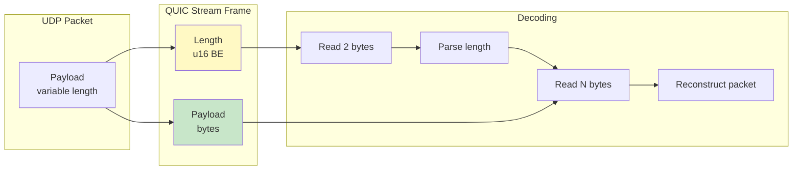

---

## Component Details

### Endpoint (iroh)

The `iroh::Endpoint` provides:

- **Discovery**: Automatic peer discovery via Pkarr/DNS/mDNS
- **Relay**: Fallback relay servers for NAT traversal
- **QUIC**: Built-in QUIC transport with hole punching
- **Identity**: Ed25519-based peer identity and authentication

---

## Performance Considerations

### Connection Establishment Times

> **Note:** These are illustrative, environment-dependent ranges (network conditions, NAT type, relay availability, and DNS). Treat as rough guidance, not guarantees.

```mermaid
graph LR
    subgraph "iroh"
        A[Discovery: 1-3s]
        B[Connection: 0.5-2s]
        C[Total: 1.5-5s]
    end

    style C fill:#FFF9C4
```

### Throughput Characteristics

- **TCP Tunneling**: Limited by QUIC stream flow control and congestion control
- **UDP Tunneling**: Additional framing overhead (2 bytes per packet)
- **Relay Mode**: Higher latency, potentially lower throughput
- **Direct Mode**: Near-native performance with encryption overhead

---

## Error Handling

### Connection Failures

```mermaid
graph TB
    A[Connection Attempt] --> B{Success?}
    B -->|Yes| C[Established]
    B -->|No| E{Relay available?}

    E -->|Yes| F[Fallback to relay]
    E -->|No| G[Connection failed]

    F --> C

    style C fill:#C8E6C9
    style F fill:#FFF9C4
    style G fill:#FFCCBC
```

### Exit Codes (Client Mode)

The client process uses categorized exit codes so wrapper scripts can distinguish
transient failures (retry) from permanent errors (stop):

| Code | Category | Examples |
|------|----------|---------|
| 0 | Success | Normal termination |
| 1 | General error | Unexpected/uncategorized failures |
| 2 | Configuration | Missing `--source`, invalid token format, bad ALPN |
| 3 | Authentication | Token rejected by server, auth response timeout |
| 10 | Connection failed | Relay timeout, endpoint offline, server unreachable |
| 11 | Connection lost | QUIC connection closed after tunnel was established |

Retry guidance:

- **Code 1** — Ambiguous. Retry a limited number of times with backoff; escalate if the error persists.
- **Codes 2, 3** — Do not retry. These require human intervention (fix config or credentials).
- **Code 10** — Connection establishment failed. Retry only if the tunnel has previously connected successfully.
- **Code 11** — Connection lost after the tunnel was working. Always safe to retry.

### Stream Errors

- **TCP**: Connection reset, timeout → close QUIC stream
- **UDP**: Packet loss → no retry (UDP semantics preserved)
- **QUIC**: Stream reset → close local TCP connection or stop UDP forwarding

---

## Capabilities

| Feature | Support |
|---------|---------|
| Multi-Session | **Yes** - Multiple concurrent connections to the same server |
| Dynamic Source | **Yes** - Client specifies which service to tunnel (via `--source`) |
| Encryption | QUIC/TLS 1.3 |
| Platform | Linux, macOS, Windows |

---

## References

- [iroh Documentation](https://iroh.computer/)
- [RFC 9000 - QUIC](https://datatracker.ietf.org/doc/html/rfc9000)
